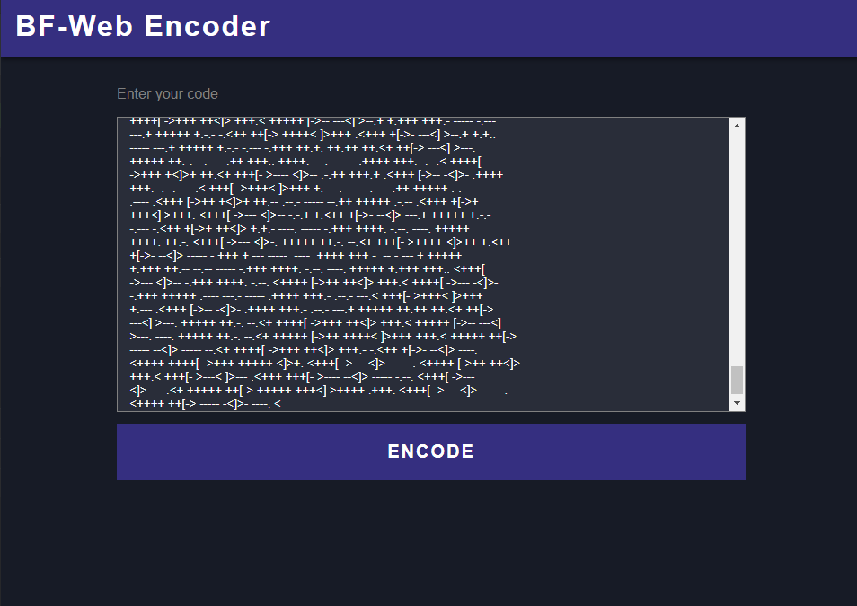

<script lang="ts">
    import MarkdownLink from "$md/MarkdownLink.svelte";
    import examplePageLink from "./examplePageLink.txt?raw";
</script>

## BF-Web is a program allows you to use brainf*ck for web development.

<MarkdownLink href="https://bf-web.qrl.nz/" color="#342e7e">BF-Web Encoder</MarkdownLink>
<MarkdownLink href="https://github.com/Questionable-Research-Labs/web.bf">Questionable-Research-Labs/web.bf</MarkdownLink>
<MarkdownLink href="https://terriblehack.com/">Produced for the Terrible Ideas Hackathon</MarkdownLink>


Brainf*ck is the future of programming, and this brings it to the web using initiative concepts that take the load off your servers.

### Example Usage

Let's go through the process to use [this example website][web-bf-example], which doesn't support mobile (*which is most definitely not from intense technical limits on length*)

First you start out your super simple brainf*ck code:

```brainfuck
+++++ [->++ +++<] >++++ +++.< +++++ [->++ +++<] >+++. <++++ +++[- >++++
+++<] >++++ ++.+. +++++ .<+++ [->-- -<]>- ---.- ----- -.<++ ++++[ ->---
---<] >---. <++++ +[->- ----< ]>--- --.<+ +++++ ++[-> +++++ +++<] >++.<
+++[- >+++< ]>+++ +.<++ +[->- --<]> --.<+ +++[- >++++ <]>++ +++.< +++++
++++[ ->--- ----- -<]>- ----- --.<+ +++++ +++[- >++++ +++++ <]>++ +++++
+++.< +++++ ++++[ ->--- ----- -<]>- ----- ----. <++++ ++++[ ->+++ +++++
<]>++ +++++ +.--- .++++ .--.+ .<+++ [->++ +<]>+ ++.<+ +++++ +[->- -----
-<]>- ----- ---.< +++++ [->-- ---<] >-.<+ +++[- >++++ <]>+. -..<+ +++++
++[-> +++++ +++<] >++++ ++.<+ ++[-> ---<] >---- -.<++ ++++[ ->--- ---<]
>---- ----- .<+++ ++[-> ----- <]>-- .<+++ +++++ +[->+ +++++ +++<] >++++
++.<+ ++[-> ---<] >---- -.--- --.<+ +++[- >+
... and it continues
```
<MarkdownLink href="https://gist.github.com/Fallstop/41297649a5a2880e834e08450dd73e82">Full Brainf*ck Code</MarkdownLink>


Then put the brainf*ck into our [Online Encoder](https://bf-web.qrl.nz/):



Now with the click of a button, you get a hosted URL which you can share around! In the example, it generates [the link from earlier]({examplePageLink}), which is only 19 thousand characters long.


<MarkdownLink color="#342e7e" href={examplePageLink}>
Example Site
</MarkdownLink>

