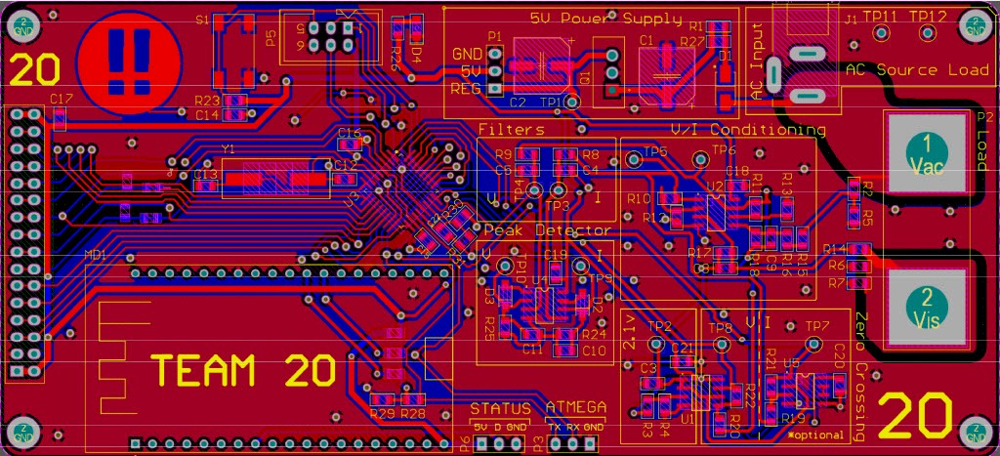
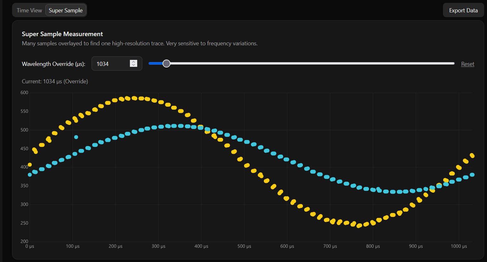
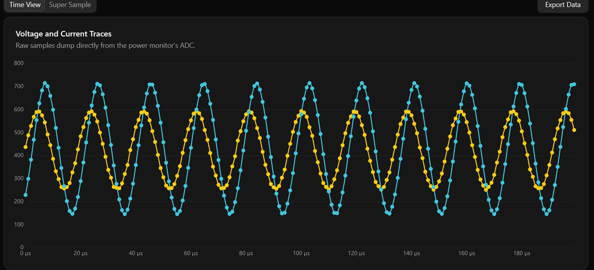
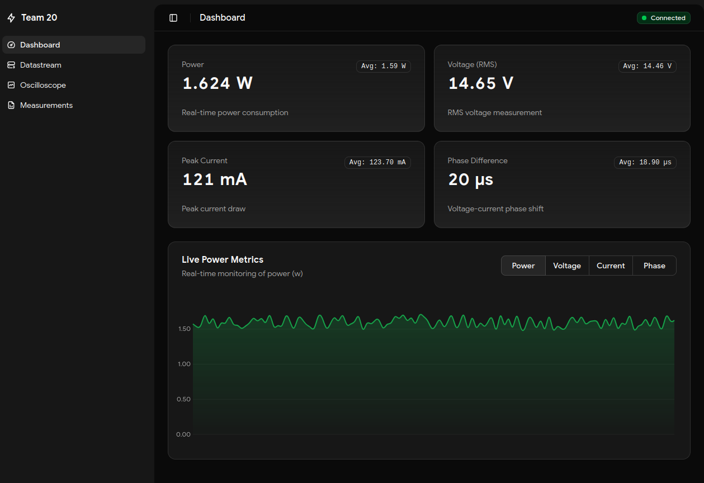
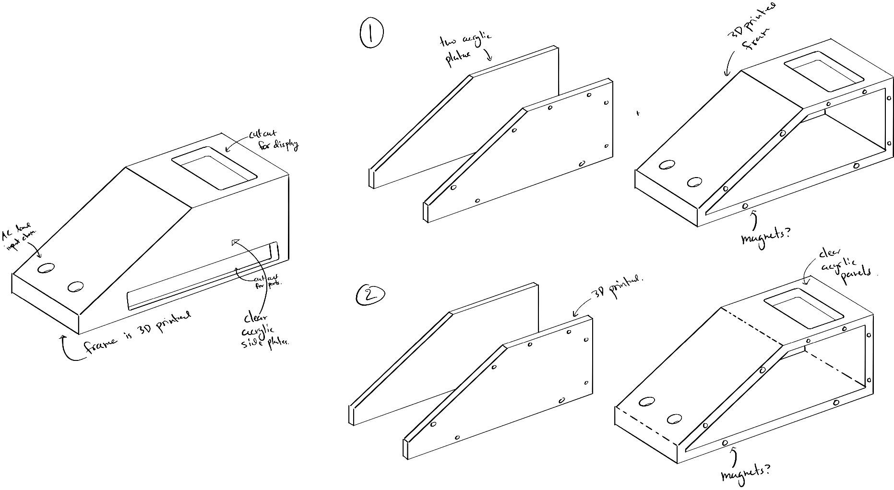
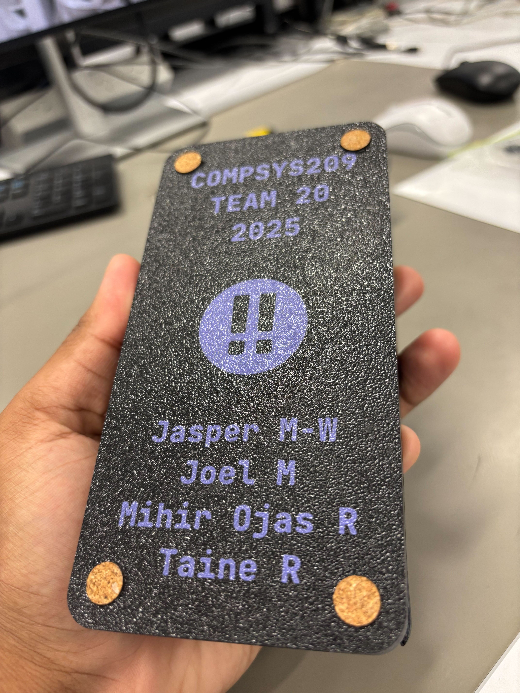

## The Challenge

The course gave us a fictional appliance: a 14V RMS, 500Hz AC system with loads from 2.5VA to 7.5VA. The constraints were real enough:

- **ATMega328PB at 2MHz** (max ADC rate: 9.6 kHz)
- **ESP32 required** for the Smart Energy Challenge bonus
- Double-layer PCB with the **cheapest SMT components** the Uni could source
- **5% accuracy** requirement across full scale

The analog design became the heart of the project - four dual op-amp chips (8 op-amps total) handling signal conditioning, filtering, and isolation for both voltage and current measurements.

But here's the thing about accuracy: 5% is easy. 1% is hard. 0.1% is where the real engineering happens. And we weren't about to start doing real engineering.

We headed straight for 0.5% accuracy, because if you're going to do something, do it mostly right™.

## The Architecture

The system was split into two distinct modules, each with its own microcontroller. The ATMega328PB handled the precision measurement, while the ESP32 managed connectivity and user interface. This separation meant we could optimize each for its specific role without compromise.

## The Analog Front-End

The real engineering of this project lived in the analog domain. Eight op-amps across four dual packages formed a signal chain that took raw AC waveforms and transformed them into something our slow ADC could actually use.

### Signal Conditioning

The first challenge was scaling. Our input was 14V RMS AC - way too hot for a 5V microcontroller. We needed to:

- **Scale down** the voltage to fit within a 0-4.2V range
- **Offset** the signal to center it at 2.1V (so negative half-cycles didn't go below ground)
- **Maintain precision** through the entire process

This meant precision resistor dividers feeding into unity-gain buffers, with careful attention to impedance matching. Every millivolt of error here propagated through the entire measurement chain.

### Active Low-Pass Filtering

With a 500Hz signal and 9.6kHz ADC rate, we had just 19.2 samples per period - tight, but workable. The real concern was aliasing. Any noise above 4.8kHz would fold back into our measurement band and corrupt our readings.

We implemented active second-order Sallen-Key low-pass filters with a cutoff around 2kHz. Active filters gave us better roll-off than passive RC networks, and the op-amp buffering meant the filter characteristics didn't shift with ADC input impedance.

### Peak Detection (The Road Not Taken)

Our initial plan was elegant: use hardware peak detection to grab the maximum voltage and current values, measure the phase offset between the two zero-crossing detectors (one for voltage, one for current), assume perfect sine waves, and calculate power directly. No waveform sampling needed - just peaks and phase. Precision diodes and hold capacitors gave us analog peak-hold circuits, with op-amp buffering so the ADC could read the values without draining the hold caps.

Then we connected it to the test rig. The "sine waves" were anything but, they were heavily distorted waveforms that made peak-based calculations useless. A distorted wave with the same peak as a pure sine has completely different RMS and power values, and the phase relationship between zero crossings means nothing when the waveform isn't sinusoidal. We abandoned the approach and pivoted to full waveform sampling.

### Zero-Crossing Detection

The heart of our phase-locked sampling was the zero-crossing detector - a comparator with hysteresis that fired a hardware interrupt at the exact moment the voltage waveform crossed through zero. The hysteresis prevented noise-induced false triggers, and the hardware interrupt meant sub-microsecond timing precision.

### Virtual Ground

With single-supply operation, we needed a rock-solid 2.1V reference for all our signal offsets. A simple resistor divider wasn't good enough - the varying load from multiple op-amp stages would cause the reference to droop. A dedicated buffer op-amp provided the low-impedance virtual ground that kept everything stable.

The PCB was pure SMT; no dev boards, no compromises. 0805 passives because 0603 is for people with better eyesight, and proper ground planes because signal integrity isn't optional when you're chasing 0.5% accuracy.

The course also required a through-hole "backup" design in case the SMT board failed. We built it. It worked. The routing reflected exactly how much we expected to use it.

## Interrupt Timing and The Display Problem

One of our most frustrating debugging sessions came from an unexpected source: the 7-segment display. The oscilloscope told us exactly what was happening.

The ATMega328PB has a single ADC with no DMA - every conversion requires CPU attention. But the 7-segment display also needs constant servicing; it's multiplexed, meaning we cycle through each digit rapidly to create the illusion of a continuous display. This cycling runs on a timer interrupt.

The problem: when the display interrupt fires *during* an ADC sampling burst, it preempts everything, updates the display segment, then returns. But now our carefully timed ADC samples are pushed - the phase relationship we worked so hard to establish is corrupted.

The AVR architecture made this worse. There are no interrupt priority levels. First interrupt wins, others queue. Our ADC could trigger on timer compare events, but the display multiplexing wanted those same timer resources. At 2MHz system clock with 16x prescaler, we got a 125kHz ADC clock, meaning ~104µs per conversion. A display interrupt taking even 50µs throws off the entire phase-locked sampling window.

The solution was brutal but effective: disable interrupts entirely during ADC bursts using `cli()`/`sei()`. The display could wait 20ms; the phase-locked sampling could not. Minor display flicker was imperceptible at the 500Hz waveform rate, and our sample timing became rock-solid.

## The Secret Sauce: Phase-Locked Sampling

Here's where the magic happens. Most power meters sample voltage and current in a tight loop, accepting the small phase error between samples. We refused to accept that error.

Our technique worked like this:

1. **Wait for the zero crossing** of the voltage waveform (detected via hardware interrupt)
2. **Sample 200 voltage points** in a burst at 9.6kHz
3. **Wait for the next zero crossing**
4. **Sample 200 current points** in an identical burst
5. **Overlay the results** in software

<PhaseLockedSampling/>

Because both sampling bursts started at the exact same phase reference point, we could overlay them perfectly. The result was a high-resolution reconstruction of both waveforms with effectively zero phase error between them.

We called it "Super Sampling" because we didn't know the established term was phase-locked sampling. The engineering was solid either way. This technique gave us the measurement accuracy that won us the best accuracy award.

## The Sensing Node Display

With the analog front-end feeding clean signals and our timing issues solved, the ATMega328PB could finally do its job. The 7-segment display provided immediate local feedback - power readings updated in real-time without needing to connect to the web interface.

## The Interface Node: ESP32

The ESP32 was our connectivity brain, required for the Smart Energy Challenge bonus. It spoke to the AVR via UART, hosted a WiFi access point with captive portal, and served a full SvelteKit web application from a LittleFS partition.

When you connected to the "Team 20" WiFi network, your browser automatically opened to our dashboard. No app store, no installation, just instant access to real-time power data, oscilloscope views, and firmware updates. It was the kind of seamless experience that makes you forget you're talking to a 2MHz microcontroller measuring fictional appliances.

## The Oscilloscope Mode

The phase-locked sampling wasn't just for accuracy - it let us build something beautiful. Our oscilloscope mode captured a large sample of these perfectly aligned waveforms and pushed them up to the web interface on demand.

The frontend would request a capture, the AVR would perform the synchronized sampling dance, and within seconds you'd see crisp, stable waveforms on your phone. The waves were so stable because they were literally locked to the same physical reference point every time.

## The Web Interface: SvelteKit on a Microcontroller

Building a web app that runs on a microcontroller sounds terrible until you realize it's brilliant. We used ESP32 SvelteKit and stored the entire frontend in a LittleFS partition.

Here's the trick: the raw build was too large for the ESP32's limited flash. So we pre-gzipped every asset and only uploaded the compressed versions. Every modern browser handles gzip-encoded responses transparently, so the ESP32 just serves the compressed files directly without ever storing or transmitting the uncompressed originals. The space savings were massive, and from the browser's perspective, it only loaded faster.

The interface gave users a real-time dashboard with live power measurements, an oscilloscope view with our super-sampled waveforms, data logging with CSV export, and a firmware update system. Connection indicators showed the health of the entire signal chain.

The captive portal meant users didn't need to know an IP address. Connect to WiFi, get redirected to the app, instant power monitoring.

## The Bootloader: Updating Firmware Over WiFi

The OTA system started as a "nice to have" feature. It became essential.

The lab-provided ATMega programmers were unreliable in ways that seemed almost personal. They'd work on one computer, then refuse to connect for a week. Teams without their own hardware were either buying programmers out of pocket or sharing the one reliable unit around the lab. This killed iteration speed.

So we built a custom bootloader that let the AVR rewrite its own flash from commands sent by the ESP32:

1. Upload new AVR firmware through the web interface
2. ESP32 stores the binary and signals the AVR
3. AVR jumps to bootloader at address 0x7c00
4. ESP32 streams the new firmware byte by byte
5. AVR writes to flash and verifies
6. Reboot into new firmware

It was terrifying the first time we tried it. One wrong byte and we'd brick our measurement brain. But when it worked - when we could update the core measurement code from a web browser while other teams hunted for a working programmer - it felt like magic.

The PCB was designed in Altium Designer with full surface-mount components, ATmega328PB in TQFP package, proper ground planes for signal integrity, and headers for programming and debugging (which we used exactly once before the OTA system was live).

## The Enclosure: Form Meets Function

With the electronics sorted, we needed somewhere to put them. The case went through several design iterations before we settled on a hybrid approach: 3D printed frame with clear acrylic panels.

The sketches show our thinking - we wanted the display visible and angled for easy reading, ports accessible from the side, and (importantly) the ability to show off the PCB through clear panels.

The final build used a textured black PLA frame with laser-cut acrylic on the top and bottom. The 3D printed standoffs at the corners tied everything together, and the bottom panel got the full treatment: team branding, member names, and a custom logo.

## The Competition: Datamars Judging

The final judging by Datamars was intense. We had to demonstrate our system, explain our design choices, and show that we could achieve the required accuracy. Our phase-locked sampling technique impressed the judges, especially when they saw the oscilloscope mode in action.

When they announced we'd won first place and the accuracy award, it validated everything we'd built. All those hours debugging timing issues, all the iterations on the PCB, all the late nights optimizing the web interface - it was worth it.

> Film photo taken and kindly shared by <a href="https://www.austinsprojects.com/" target="_none" rel="nofollow">Austin Jensen</a>

## What We Learned

This project taught us that the best engineering is knowing when to be clever and when to be simple. The phase-locked sampling was clever. The web interface was simple for the user. The combination worked.

We also learned that over-engineering isn't always bad. Did we need a SvelteKit app to measure power? No. Did it make the project infinitely cooler and more usable? Absolutely.

The key was that every "extra" feature served a purpose. The oscilloscope helped debug and demonstrate accuracy. The web interface made the data accessible. The OTA updates made development faster when the lab hardware failed us. Every piece of over-engineering made the system better in a tangible way.

The Smart Energy Monitor now sits on a shelf as a reminder that sometimes the best way to solve a simple problem is to make it <i>delightfully complex</i>.
