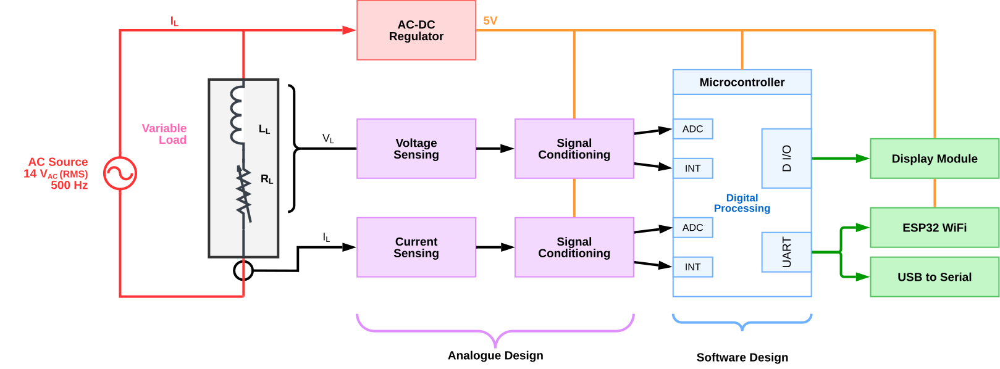

## The Challenge

This wasn't a real appliance monitor - the course gave us a made-up challenge: measure power on a 14V RMS, 500Hz AC system with loads ranging from 2.5VA to 7.5VA. The constraints were brutal:

- **ATMega328PB at 2MHz** (max ADC rate: 9.6 kHz)
- **ESP32 required** for the Smart Energy Challenge bonus
- **Double-layer PCB** with SMT components
- **5% accuracy requirement** across full scale

The analog design became the heart of the project - four dual op-amp chips (8 op-amps total) handling signal conditioning, filtering, and isolation for both voltage and current measurements.

But here's the thing about accuracy: 5% is easy. 1% is hard. 0.1% is where the real engineering happens. And we weren't about to settle for "good enough."

## The Architecture: Two Brains Are Better Than One

We split the system into two distinct modules, each with its own microcontroller. The ATMega328PB handled the precision measurement, while the ESP32 managed connectivity and user interface. This separation meant we could optimize each for its specific role without compromise.

### The Sensing Node: ATMega328PB
Our measurement brain was an ATMega328PB running at 2MHz - a constraint that forced creative solutions. With only 9.6kHz maximum ADC sampling rate, we couldn't afford to waste a single cycle. The analog front-end became critical: four dual op-amp chips (8 op-amps total) handling signal conditioning, filtering, and peak detection.

Each op-amp had a specific job:
- **Signal Conditioning**: Scaling and offsetting the AC signals to center them at 2.1V for the ADC.
- **Active Peak Detectors**: Precision peak-hold circuits for hardware-validated voltage and current max values.
- **Zero-crossing detection**: Comparators with hysteresis to provide the rock-solid trigger for our phase-locked sampling.
- **Virtual Ground**: Buffering the 2.1V reference to ensure signal integrity across the board.

The PCB was pure SMT - no dev boards, no compromises. 0805 passives because 0603 is for people with better eyesight, and proper ground planes because signal integrity isn't optional when you're chasing 0.1% accuracy.

### The Interface Node: ESP32
The ESP32 was our connectivity brain, required for the Smart Energy Challenge bonus. It spoke to the AVR via UART, hosted a WiFi access point with captive portal, and served a full SvelteKit web application. The entire frontend compiled into a header file that got baked into the firmware - because apparently we hate ourselves.

When you connected to the "Team 20" WiFi network, your browser automatically opened to our dashboard. No app store, no installation, just instant access to real-time power data, oscilloscope views, and firmware updates. It was the kind of seamless experience that makes you forget you're talking to a 2MHz microcontroller measuring fictional appliances.

## The Secret Sauce: Phase-Locked Sampling

Here's where the magic happens. Most power meters sample voltage and current in a tight loop, accepting the small phase error between samples. We refused to accept that error.

Our technique worked like this:

1. **Wait for the zero crossing** of the voltage waveform (detected via hardware interrupt)
2. **Sample 200 voltage points** in a burst at 9.6kHz
3. **Wait for the next zero crossing**
4. **Sample 200 current points** in an identical burst
5. **Overlay the results** in software
<PhaseLockedSampling/>
<!--  -->

Because both sampling bursts started at the exact same phase reference point, we could overlay them perfectly. The result was a high-resolution reconstruction of both waveforms with effectively zero phase error between them.

We called it "Super Sampling" mostly just because we didn't know it was called phase-locked sampling when we designed the system, but the engineering was solid. This technique gave us the measurement accuracy that would eventually win us the best accuracy award.

## The Oscilloscope Mode: Visualizing the Invisible

The phase-locked sampling wasn't just for accuracy - it let us build something beautiful. Our oscilloscope mode captured these perfectly aligned waveforms and displayed them in real-time on the web interface.

The frontend would request a capture, the AVR would perform the synchronized sampling dance, and within seconds you'd see crisp, stable waveforms on your phone. The waves were so stable because they were literally locked to the same physical reference point every time.

<!--  -->

It was mesmerizing. Hours were lost watching perfect sine waves scroll across the screen, each one a testament to the power of waiting for the right moment to sample.

## The Web Interface: SvelteKit on a Microcontroller

Building a web app that runs on a microcontroller sounds terrible until you realize it's brilliant. We used ESP32 SvelteKit, which compiles the entire frontend into a header file that gets baked into the firmware.

The interface gave users a real-time dashboard with live power measurements, an oscilloscope view with our super-sampled waveforms, data logging with CSV export, and a firmware update system. Connection indicators showed the health of the entire signal chain.

The captive portal meant users didn't need to know an IP address. Connect to WiFi, get redirected to the app, instant power monitoring. It was the kind of seamless experience that makes you forget you're talking to a 2MHz microcontroller.

## The Bootloader: Updating Firmware Over WiFi

One of our proudest achievements was the over-the-air firmware update system. The AVR contained a custom bootloader that could rewrite its own flash memory based on commands from the ESP32.

The process worked like this:
1. Upload new AVR firmware through the web interface
2. ESP32 stores the binary and signals the AVR
3. AVR jumps to bootloader at address 0x7c00
4. ESP32 streams the new firmware byte by byte
5. AVR writes to flash and verifies
6. Reboot into new firmware

It was terrifying the first time we tried it. One wrong byte and we'd brick our measurement brain. But when it worked - when we could update the core measurement code from a web browser - it felt like magic.

## The Hardware: SMT and 3D Printing

The PCB was designed in Altium Designer with full surface-mount components. No through-hole parts here. We used an ATmega328PB in TQFP package, 0805 passives because 0603 is for people with better eyesight, proper ground planes for signal integrity, and headers for programming and debugging.

We designed a 3D printed enclosure that held the PCB and provided mounting for the LCD display. The case evolved through multiple iterations, each one getting cleaner and more professional.

<!--  -->

## The Competition: Datamars Judging

The final judging by Datamars was intense. We had to demonstrate our system, explain our design choices, and show that we could achieve the required accuracy. Our phase-locked sampling technique impressed the judges, especially when they saw the oscilloscope mode in action.

When they announced we'd won first place and the accuracy award, it validated everything we'd built. All those hours debugging timing issues, all the iterations on the PCB, all the late nights optimizing the web interface - it was worth it.

## What We Learned

This project taught us that sometimes the best engineering is knowing when to be clever and when to be simple. The phase-locked sampling was clever. The web interface was simple for the user. The combination worked.

We also learned that over-engineering isn't always bad. Did we need a SvelteKit app to measure power? No. Did it make the project infinitely cooler and more usable? Absolutely.

The key was that every "extra" feature served a purpose. The oscilloscope helped debug and demonstrate accuracy. The web interface made the data accessible. The OTA updates made development faster. Every piece of over-engineering made the system better in a tangible way.

## The Future

The Smart Energy Monitor was more than a course project. The modular architecture means we could add cloud connectivity for long-term logging, machine learning for anomaly detection, or integration with home automation systems. But for now, it sits on my shelf as a reminder that sometimes the best way to solve a simple problem is to make it delightfully complex.
