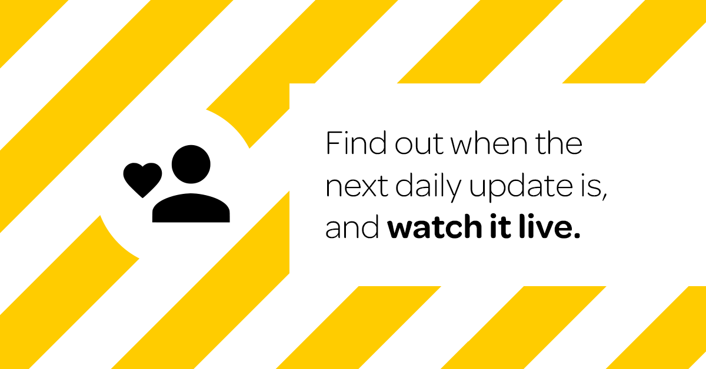

<MarkdownLink href="https://github.com/Fallstop/CovidAnnouncementTimer">Frontend</MarkdownLink>
<MarkdownLink href="https://github.com/Fallstop/CovidAnnouncmentBackend">Backend</MarkdownLink>
<MarkdownLink href="https://dailyupdate.nz">dailyupdate.nz</MarkdownLink>

### Find out when the daily update is and watch it live.

This was made in collaboration with [Zac M-W](https://zac.nz), and uses a combination of scraping and youtube API's to determine when the daily update is going to happen, and then to supply links to the youtube live stream along with past announcements in a digestible way.

## The Stack

#### Frontend
The frontend is a Svelte Kit app that is using the static-adapter to be deployed on Cloudflare Pages for the [dailyupdate.nz domain](https://dailyupdate.nz). It regularly calls the API methods to update the state of the app.

#### Backend
The backend, because of all the scraping, is a FastAPI python webserver. This auto updates the [API docs](https://covid-announcement-backend.host.qrl.nz/docs). The idea of the backend is focused of having instant responses, and having all the heavy working down by background workers that constantly run and update according to a schedule.