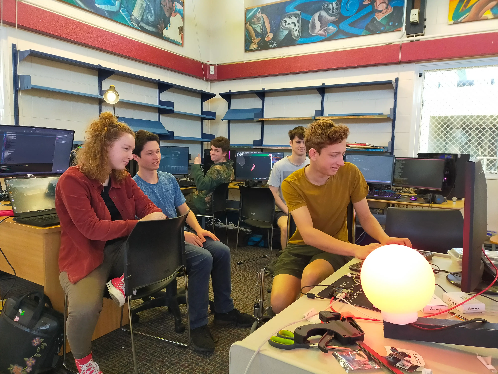

<MarkdownLink href="https://next.jmw.nz/s/i84kc8MAzHtm9Sr">Poster PDF</MarkdownLink>
<MarkdownLink href="https://dirtywatts.nz">dirtywatts.nz</MarkdownLink>
<MarkdownLink href="https://github.com/Questionable-Research-Labs/DirtyWatts">Questionable-Research-Labs/DirtyWatts</MarkdownLink>

In **Aotearoa**, our ***power*** is not always from renewable sources. **Coal** is used when there is high demand. Every bit of electricity you use at these peak times means **more coal is burnt**. But, **what if you could tell when coal is being burned for power?** Would you still charge your car? Would you still put your clothes in the dryer, knowing **YOU** are **burning coal** to do that?

# Original DirtyWatts Project

<MarkdownLink href="/projects/DirtyWatts">Original DirtyWatts Project</MarkdownLink>

Micro-Indicators is a branch off another project with a whole team behind it.

### Indicator Device
Aside from the main dashboard, there was a side project being worked, a DirtyWatts Indicator. Taine Reader and Ara Bartlett with the mentoring of Mac Jones built a hardware summary device that showed the state of the power grid through a single Indicator light. It scales from red at worst, to orange, to yellow, to green at best, considering which sources of power are active to give a metric of how "clean" your power is.

Initially, it was meant as a demonstration of the new public simplified data source that we built to power the main dashboard, but the concept expanded into the education space as the idea developed. I absolutely loved the concept of the Indicator device to summarise the data from the dashboard, and the team did a pretty good job of throwing together a prototype over the weekend. The Indicator used an Orange Pi with a Zigbee dongle to control a Philip Hue light, which was great for rapid prototyping, but was clunky and expensive to set up.

### Micro-Indicator Jumpstart
The project DirtyWatts did really well in GovHack, well enough that five of the team members got flights over to Melbourne for the red-carpet award ceremony. They wanted us to set up a stall with our project over the ditch! There was one snag though, we only had one lamp to show off, and we had an entire stall to fill in exactly two weeks.

Like any sane person, **this is where I kicked off the Micro-Indicator project**.

We needed another four devices that used cheap and accessible components that could demonstrate the power of DirtyWatts's public data source. I started simple, creating two simple light designs in the first week, adding support for my watch in the second, and finally making a demo site that could show the full range of colours during the flight to Australia. Somehow, against all laws of live demonstrations, it worked flawlessly during the presentations! Only now, after coming back from Melbourne with my four devices, I started thinking about where to take this new DirtyWatts **Micro**-Indicator project to.

<MarkdownLink href="https://www.youtube.com/watch?v=E1cI-Sp0W-Q">Melbourne Travel Vlog</MarkdownLink>

That’s where I decided to transition the project into my 2023 Science Fair, first developing out a portfolio of devices and then developing the education component by creating guides on how to build the devices.

# Meet Micro-Indicators
## What is a Micro-Indicator?

The New Zealand power grid is in constant flux, the power demand skyrockets in the afternoon and plummets at night. To supply the power spikes, the grid is forced into mixing its coal and gas backups into its renewable power. A DirtyWatts Micro-Indicator is a small physical device that takes live data from the power grid, and reports back if the grid power is “Clean” or “Dirty”. Most devices show how clean the grid is through an Indicator light, but some display the current renewable energy mix or simply activate when depending on the grid conditions.

With these devices, you can target your power usage to more renewable power and reduce your carbon footprint. If the Micro-Indicator light is blood-red, you might want to delay high load power draws, like charging your electric car, running the dishwasher, or drying your clothes. It gives you an intuitive sense of how strained the power grid is right now, and the best to time to load everything up.

## Micro-Indicator Framework

To build micro-indicators, I wanted it to be a modular platform that any number of devices could be built on top of. To do this, I started fresh and designed a modular PlatformIO C++ codebase that could target almost any ESP processor variant. The base build just consisted of a Wifi configuration portal, an HTTPS connection to the DirtyWatts public API, and the scoring algorithm required to portray the power station stats as a colour.
The codebase is designed so that anyone can download it, and automatically get libraries, tool chains, and everything up and working.

<MarkdownLink href="https://github.com/Questionable-Research-Labs/DirtyWatts/tree/main">Questionable-Research-Labs/DirtyWatts</MarkdownLink>

# Micro-Indicator Arsenal
## Base Electronics
The leanest and cheapest Micro-Indicator there is. It consists of just two components, a wifi-enabled microcontroller and some RGB lights.

## Smart Socket
Did you know that, inside many standard smart-sockets, is the same family of chips that DirtyWatts was designed for? This smart plug is from Bunnings, which I took the cover off, soldered to the debug pins, and flashed with DirtyWatts firmware! It'll automatically turn the power on-and-off when the CO2e Emissions exceeds its threshold.

## Smartwatch

This device is based on my old watch, a T-Watch 2020, it's an open-source watch designed to be hacked. It runs the same processor as the rest of the devices, and the firmware on it can be flashed using the USB port on the side. To make this device, I extended the Micro-Indicator firmware quite a bit to include a GUI and battery management.

## Custom VFD Board

A while ago, I came across some mysterious 8-segment display tubes. After a bit of research, it turns out they were Vacuum Florescent Display Tubes from the USSR, the forgotten middle child between the famous Nixie Tubes, and today's LED digit displays. There was absolutely no documentation online about the particular tubes I had, creating an irresistible challenge for me. This was the perfect mini-project to finally get a chance to learn how to design circuit boards, laser cut, and test out the Micro-Indicator framework with a novel design. I took it up as a subproject showing how far you can take the Micro-Indicator framework, learning how to design circuit boards and laser cut along the way.

# Scoring Algorithm
Translating live data from the power grid into a single light

Unfortunately, we can't display every part of the power grid on one light, but we can “summarise” that information into one metric. That summarisation process is called a Scoring Algorithm. During the original GovHack competition, Taine Reader developed a Scoring Algorithm for the demonstration based off the past six hours of data, which was used initially for all devices.
Now, it's a year later and the project has collected over 110,000 data points of how the power-grid behaves throughout all seasons. The original algorithm was showing its weaknesses, so I set out to develop a new and more representative colour scale.

### CO2e Emissions by Power Source

In the end, I developed two closely linked metrics that can capture the climate impact of the grid, and then couldn't decide on which one to use for two full months.

### Cumulative CO2e Emissions
The total CO2e being released by New Zealand's grid at this moment, in Tonnes/hour. Heavily influenced by the current power output of the grid, making it cycle on a daily basis. It shows how "strained" the power-grid currently is.

## CO2e Intensity
The amount of extra CO2e emitted by the grid if you turned on an appliance, in gCO2e/kwh. Heavily influenced by sources of power and the operational status of power-plants, meaning it has much longer cycles than the Cumulative Output.

I made both options available for developers, but I went with the Cumulative CO2e Output by default because of its daily cycles, which is more informative for telling a user *when* during the day to charge their car, rather than screaming at them to not charge it for a week straight.
For display on the micro-indicators, the last step is to translate the metric onto a green to red colour scale, which I developed in the Oklab perceptually uniform colour-space with a set luminosity across the entire scale.

# Micro-Indicator Tutorial

I've compiled a comprehensive guide on how to build and program the base Micro-Indicator device, designed for someone with minimal electronic knowledge to follow along. It goes right from the start of choosing parts, to setting up software, to configuring the device. I built the tutorial because I'm always on the hunt for new rewarding projects that I can help teach people with. Building a Micro-Indicator starts out straight-forward with the foundation device, and then can be taken to any direction as further development.

<MarkdownLink href="https://wiki.dirtywatts.nz/">DirtyWatts Wiki</MarkdownLink>
