

<MarkdownLink href="https://youtu.be/YLxBEmsuL-M">Video Presentation</MarkdownLink>
<MarkdownLink href="https://github.com/Questionable-Research-Labs?q=ESquaredG&type=&language=&sort=">Source Repos</MarkdownLink>
<MarkdownLink href="https://e2g.qrl.nz/" color="#6a2675">e2g.qrl.nz</MarkdownLink>
<MarkdownLink href="https://next.jmw.nz/s/ykxMakbcpRJaNHD" color="#6a2675">Presentation File</MarkdownLink>

<YoutubeEmbed videoID="YLxBEmsuL-M"/>

# Background Information

## What is EEG?
Electroencephalography or EEG henceforth, is a method of measuring brain activity. It works by measuring the voltage between two points on the skull, typically using electrodes, probes henceforth. This is the technology that you might recognize from the sci-fi brain to computer interfaces or from a sleep lab. This fundamentally works by picking up on the electrical signals from different parts of your brain which can be used to determine the rough state of that area of the brain.

## Analog to Digital Converters

One major component of EEG is the process of converting the analog data captured by the probes into digital signals that can be handled by the brain. Computers work using a binary system to represent data, high voltage or low voltage, the voltage points are discrete. The values coming from the brain are continuous. Therefore, some process must occur to turn analog voltage levels into digital values. These devices can be found in many different products, including but not limited to: Modern Voltmeters, Oscilloscopes, and Digital Cameras. We will call these converters A->D for shorthand. An everyday example of this is the old AM (Analog) vs the newer FM (Digital) Radios, you might have noticed that AM gets more noisy and quieter as you get further from the station (In this case, the Brain), while FM stays just as clear and loud as long as it plays.

### Why those converters are so expensive
Analog to Digital converters aren't actually hugely expensive, but the ones used for EEG are very expensive for a number of reasons:
 - In the Industry Standard configuration, they have to work at very low voltages
 - Crosstalk can occur simply by having other wires close to the signal, due to the low voltages
 - Involves quantization of the input, so it necessarily introduces a small amount of error or noise, which takes good engineering to reduce

# Problem Statement
We like playing with integrating real world electronics into games and we wanted to experiment with EEG headsets, from knowing only the basic fundamentals. After some research, we came up with the ideal specs of: 8-16 channels, dry electrodes, and modifiable.

That's where we encountered our problem, we're broke students who can't afford anything on the market that even came close to our specs. Instead of backing down our expectations and going with a budget option like any other sane person, we doubled down, and started research why-the-hell they costed so much!

<!-- We started looking into what made the headsets so expensive, and we came up with two key inflated parts of the cost: The probes themselves (~$40 per probe), they had to be very low resistance, low noise, and be comfortable pressing into skin. The second major cost factor was the  -->

## Existing Solutions

### Industry Standard
The industry has thus far been restricted to enterprise/research use cases, which means that they just bite the bullet and spend whatever it costs to get the headset they need. This means that they have a direct line from the probe to an A->D converter on the controller board.

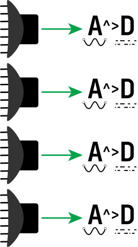

<ProConTable>
    {#snippet pros()}
      <ul>
          <li>Simple to engineer</li>
          <li>Least possible chance for noise</li>
          <li>Usually comes with software support</li>
          <li>Almost sane pricing in small probe counts (~$1000)</li>
      </ul>
    {/snippet}
    {#snippet cons()}
    <ul>
        <li>Very wasteful in parts, meaning as probe count increases, so does the cost, linearly</li>
    </ul>
    {/snippet}
</ProConTable>

### DIY Microcontroller Method
This is the alternative method. It uses amplifiers connected to general purpose microcontrollers and their embedded analog inputs, for one or two channels. The most common microcontroller of choice is the arduino uno or similar. These aren’t designed to be scientific devices, but rather as an introduction to EEG and can do basic detection.

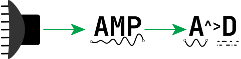

<ProConTable>
    {#snippet pros()}
    <ul>
        <li>Very cheap due to mass production of microcontrollers.</li>
        <li>Great as an introduction to the technology</li>
    </ul>
    {/snippet}
    {#snippet cons()}
    <ul>
        <li>Not very accurate (noisy and low resolution)</li>
        <li>Low channel counts mean reduced precision</li>
    </ul>
    {/snippet}
</ProConTable>

# Opportunity
We saw an opportunity to improve in this space by reducing the number of expensive A->D converters. After a bit of deliberation, we decided to bring the concept that cameras use to EEG. By having a switching system that can quickly iterate through all of the probes in use, faster than the frequency of brainwaves, 300Hz, thereby allowing us to use only one really expensive A -> D converter that runs at a high speed to service multiple probes. We came up with some different ways of accomplishing this.

## Approaches
We considered these two approaches to accomplish this:

### Many Probes to Many Multiplexer channels to One A->D
This is the simplest way to increase the number of probes. Each probe is mapped directly to its own channel on the multiplexer. This does not add much complexity to the design, but it increases the ratio of probes to A->D converters to a maximum of 16:1.

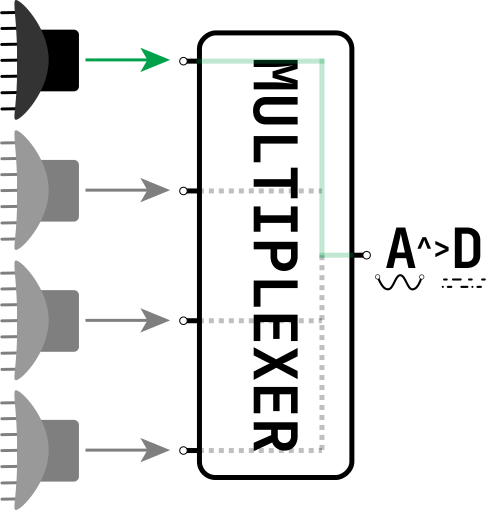

<ProConTable>
    {#snippet pros()}<ul>
        <li>Not much extra complexity</li>
        <li>Dramatically reduces cost</li>
    </ul>{/snippet}
    {#snippet cons()}<ul>
        <li>Multiplexers tend have a max of 16 inputs, reducing the theoretical limit of the approach</li>
        <li>Multiplexers could introduce significant noise into the super-low voltage data lines.</li>
    </ul>{/snippet}
</ProConTable>

### Many Probes to Many Amplifiers to some Multiplexers Channels to One A->D
This is the more complicated solution, but with a vastly increased theoretical limit. Instead of using the multiplexer to switch between the inputs, it is possible to use it in reverse as a “demultiplexer”, and use it to switch amplifiers located directly on the probes. This allows a grid layout to select one probe out of many, which means that instead of the other method’s 1:1 multiplexer channel to probe ratio, the multiplexer channel count can be calculated with f(x)→⌈2x⌉, and x is the probe count.

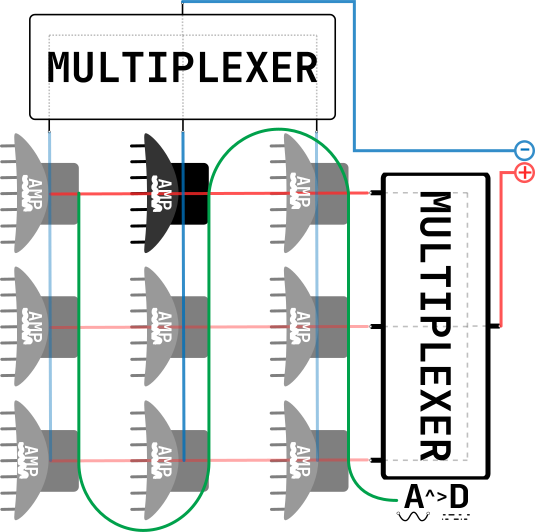

<ProConTable>
    {#snippet pros()}<ul>
        <li>Multiplexer channels required exponential falls off as more probes are added</li>
        <li>Dramatically reduces costs</li>
    </ul>{/snippet}
    {#snippet cons()}<ul>
        <li>Significantly more complex to implement</li>
    </ul>{/snippet}
</ProConTable>

# Our Implementation

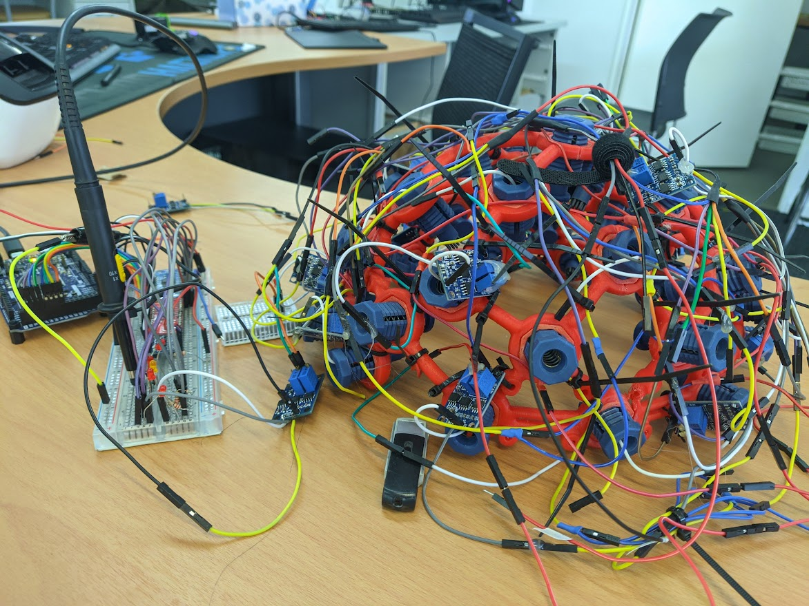

## PicoScope Streaming
All the data is gathered from the Picoscope using the amazing open source pico-sdk crate from Meaty Solutions. It’s a set of high-level, high performance, and gapless bindings and wrappers that’s driver and platform agnostic. We built in a startup CLI to find the picoscope, set speed, voltages and channels, and the sdk configures and sets up the Picoscope which then starts sending data every ~100ms to an event listener. This allows us to simply create a new thread to start the data processing.

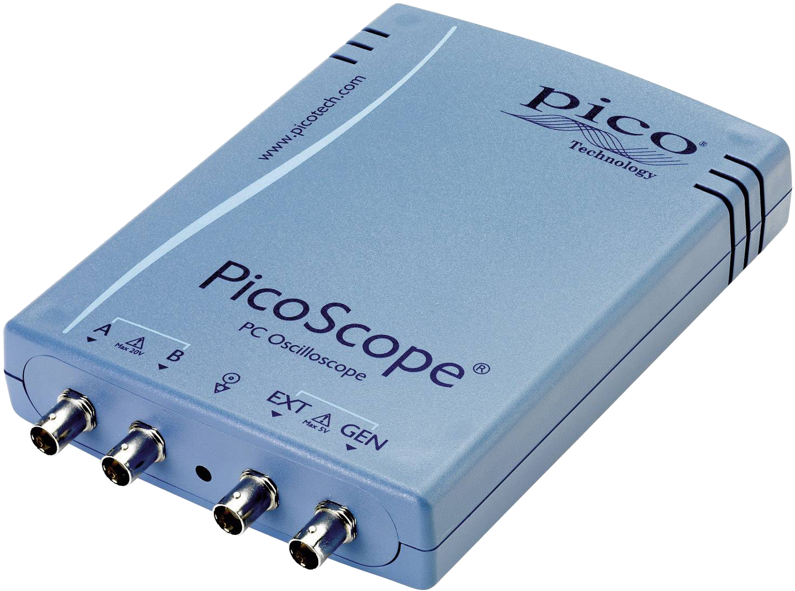

## PicoScope Streaming

Currently all we have is an stream of raw data points which we need to do 3 operations on to split into an clean set of virtual channels:

 - Find pulses from arduino
    - Take find all the data points that are outside of the range that the amplifiers are tuned to produce
    - Block together the sync pulse data points, and throw out any out of place
    - Create vector of center of Sync pulses

    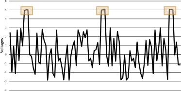
 - Use synchronisation pulses to estimate where the center of the virtual channel locations are going to be
    - Find the difference between the last sync pulse next sync pulse
    - Use difference to create a vector of pointers to virtual channels
 - Take an average of the tertile of the estimated virtual channel range
    - Iterate over virtual channel pointers and create a slice of the tertile (middle third) of the virtual channel
    - Take a mean or mode depending on the data range.
Once processed, the state mutex is unlocked and the vector of virtual channels (map of channel id’s to f64 data points) is moved over, and the thread terminates.
    
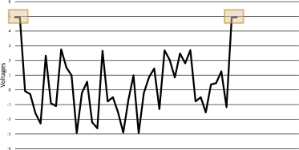

## Exporting and Visualization
Because of the amount of data, we can’t keep everything in ram, so once we have a second of data, we start the next phase of processing. In the current state of the program, this means that we only save this to an CSV in a folder, for the Jupyter Notebooks to use for visualization and debugging purposes. But this is also designed to hook in any post processing, in particular FFT (Fast Fourier Transform).

The current visualizations are done in Jupyter Notebooks (Interactive Ipython Notebook) because it’s not realtime, allowing for far more leniency on processing time.

## User Interfaces
We built in two interfaces for development and testing, a CLI and a webapp. The web app is currently disablebed because it wasn’t able to keep up with the raw data stream, and hasn’t been reimplemented with the newer processed data API’s. The CLI is still operational and is used to configure the picoscope, start/stop the recording process, and gain insights into performance and data errors in real time. The Webapp is the planned final interface, but less applicable with the current debugging.

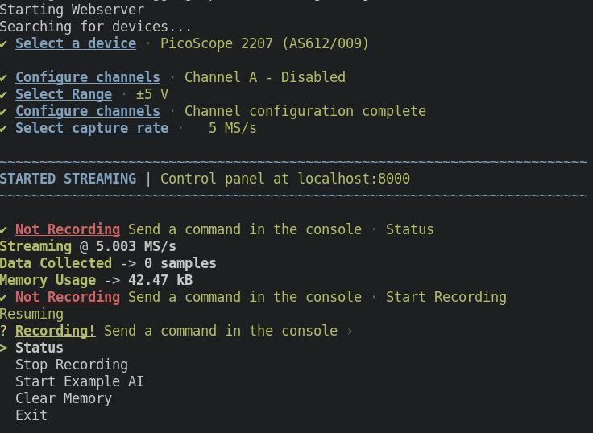

### Hardware
#### Headset
For our headset, we went with the safe option of using an almost off the shelf headset: OpenBCI ul-tracortex Mark IV. We printed the frame in two halves on a Formbot TRex 3.0 and purchased a set of probes (20 probes, and some fillers for comfort). We then assembled the headset, placing the probes in accordance with the 10-20 system.

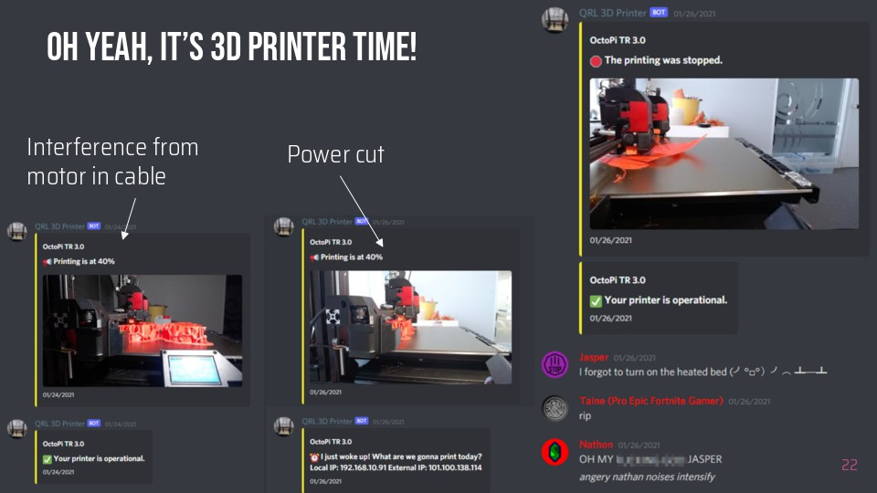

#### Circuit in detail
The design at its core is a microcontroller controlling dual de-multiplexers, one connected to +5v, the other connected to ground, which selectively powers one amplifier at a time. The amplifiers just output onto a shared bus which feeds into the input feed of the oscilloscope, along with the synchronisation pulse from the microcontroller once it has cycled through the whole set of probes.

Separating the amplifiers into rows of positives and columns of negatives and assigning each row/column to a channel on their respective multiplexer, allows us to selectively enable one amplifier at a time by selecting a specific channel on each multiplexer, completing the circuit for and thus powering only one amplifier at a time.

# Now and in the Future

## Proof of Concept
This is a sample of the planned parts laid out on a breadboard which is being used for testing and evaluating designs and parts. This design only has 4 inputs, which means it does not take full advantage of the concept, as the number of inputs is equal to the channel counts (2 Positive, 2 Negative, 4 inputs, vs aka 4 Pos, 4 Neg, 16 inputs).

Here is a video showing the tunning process to get the amplifiers into a state where they are sensitive to the correct voltages:

<YoutubeEmbed videoID="1b9_V4YS1Q8"/>

### Rough Specs:

 - Arduino Due Controller
   - Hugely expensive and over the top, but very reliable vus good for testing
   - The code also supports esp8266, which is roughly 0.5% the cost of the arduino due, but also less reliable for testing, and more weird overlapping pins.
 - Two 16 channel multiplexers
   - Some ones we were going to use later on
 - Four random AD620’s (instrumentation amplifier)
   - Smallest amount possible while still switching channels on both amplifiers.

## Prototype - Mounting to a headset
This is the step up that uses the controller board from the previous proof of concept, and mounts it to the OpenBCI headset, to test some of the advantages of the concept. This design maxes out the OpenBCI headset to the full 20 Probes (4 beyond the official max). This uses 5 groups of probes where each member of a group is on a different “chain line”.

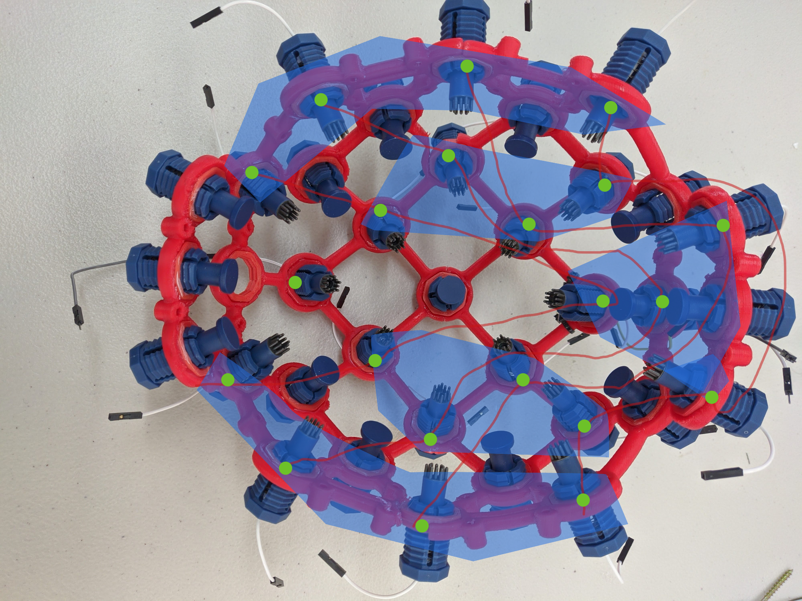

### Rough Specs:

 - Arduino Due Controller
    - Hugely expensive and over the top, but very reliable vus good for testing
    - The code also supports esp8266, which is roughly 0.5% the cost of the arduino due, but also less reliable for testing, and more weird overlapping pins.
 - Two 16 channel multiplexers
    - Some ones we were going to use later on
 - 20 Dry Electrodes
    - Upgraded to Open BCI’s better Comb Electrodes.
 - 10 Comfort Placeholders
    - These help support the weight of the headset and reduce pressure on the probes.
 - 20 AD620’s (instrumentation amplifier) directly attached to the probes
    - Smallest amount possible while still switching channels on both amplifiers.

## Prototype - Redesigned for use

Once the initial prototype is done, in the best of worlds it’s still not very durable or actually able to be used, and away from excessive testing parts, to upgrade by downgrading the parts.

In Particular, we would like to:

 - Swap AD620 modules for custom printed boards that embed into the top of the probe body.
 - Replace the expensive overpowered Picoscope 2207 for a smaller one channel Data Acquisition box
 - Experiment with faking a larger probe count to find bottlenecks.
 - Modify the OpenBCI design to allow for better cable management.

## Current State

The current state of the project is that it is still very much in the “proof of concept” stage. The foundations of the software side are mostly complete and are being used to run tests and gather objective data, which is being used to slowly build up the prototype hardware. Said hardware is still in the testing phase/bug fixing phase before being scaled up to the first prototype.

The headset is being developed concurrently with 20 probes and will have the controller board mounted to it.

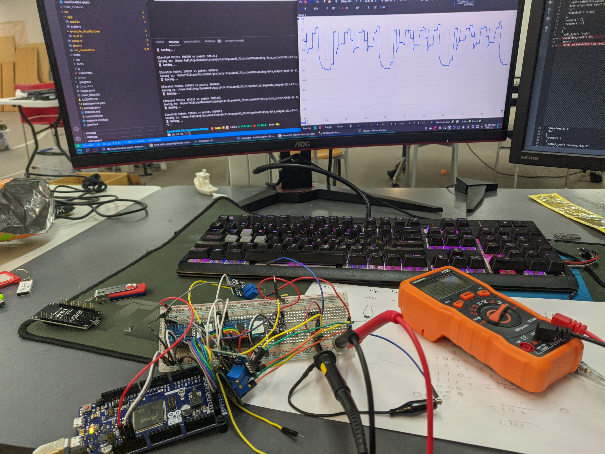

# Slideshow Presentation
