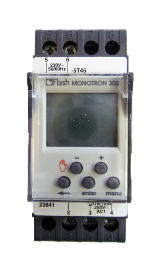
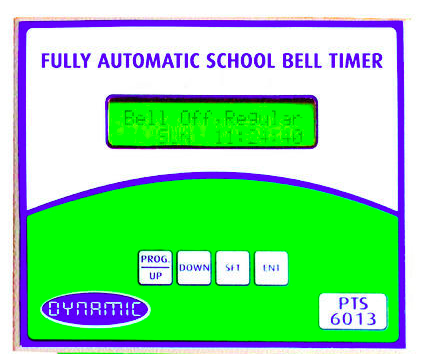
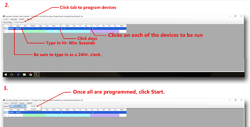
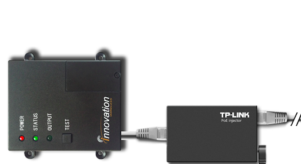
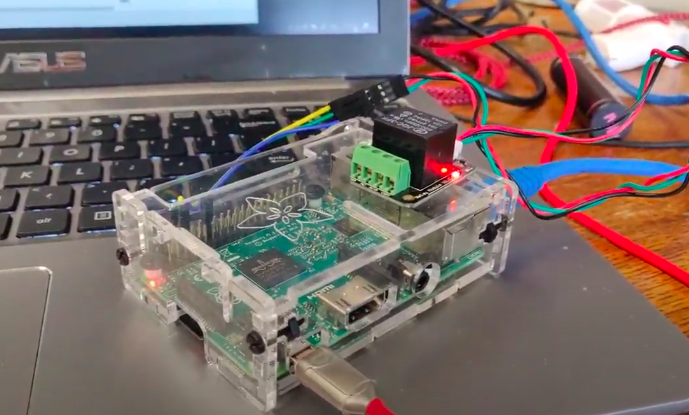
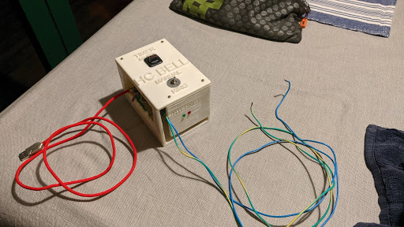
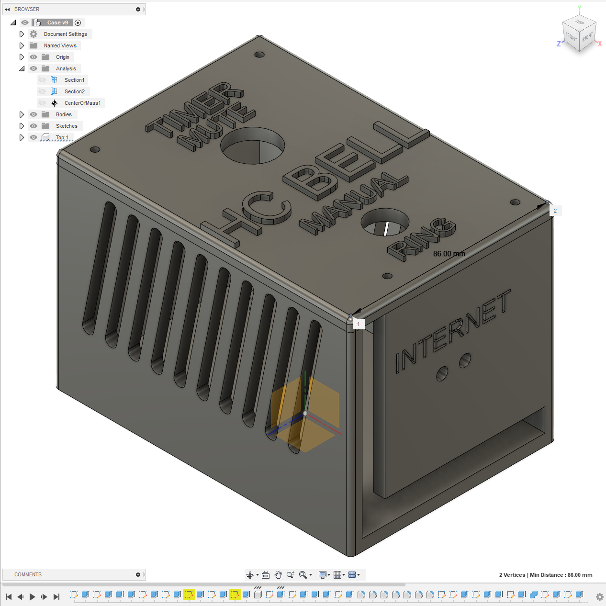
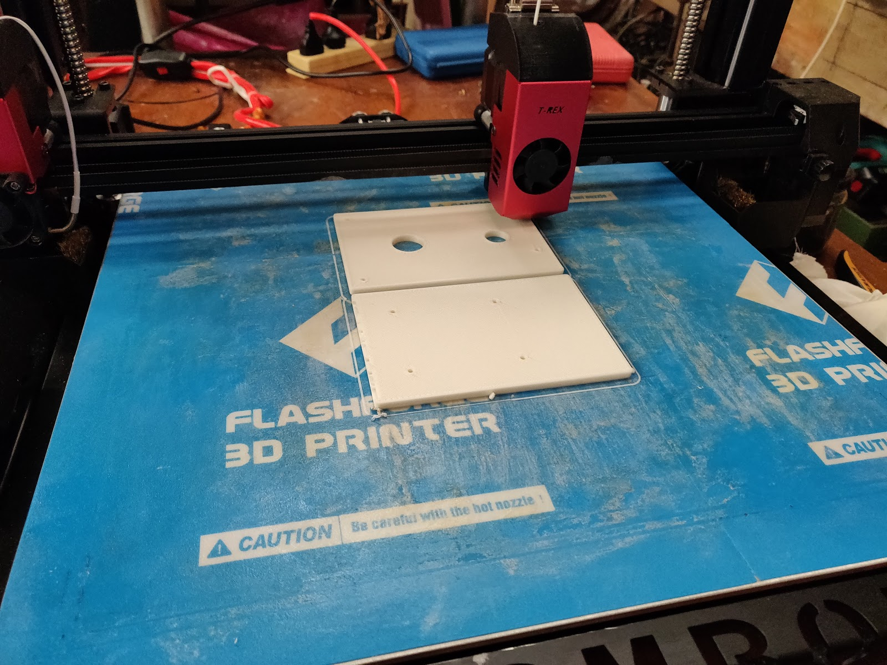
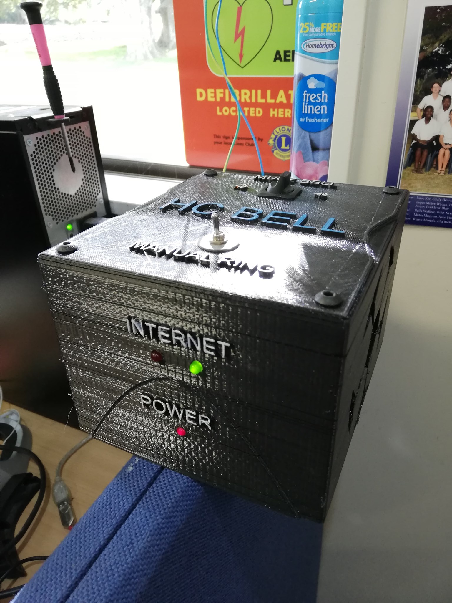
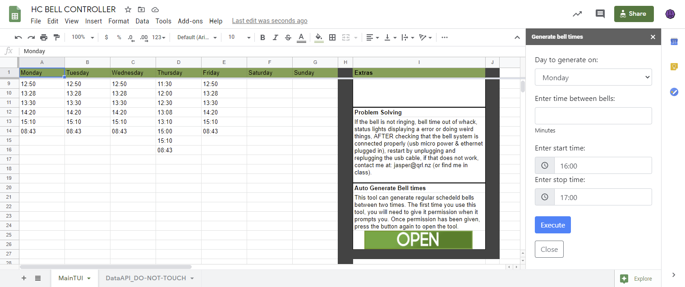

This is a project designed for the 2020 Northland Science Fair by Jasper M-W. This is a summary of the tech going into it. It's goal was to make a new bell controller for my school and has been completely and utterly successful by effectively all measures.

# But first

The following goes somewhat in depth into the design process and the choices made, for faster info go here:

<MarkdownLink href="https://drive.google.com/file/d/1wBNeWRSU5C_b58WwHalucgw1RXE5CX-l/view?usp=sharing">CN Science fair submission</MarkdownLink>

<MarkdownLink href="https://github.com/Fallstop/GSheetBells">Fallstop/GSheetBells</MarkdownLink>

## Problem

The old Huanui College bell controller was very difficult to program, had limited functionality and it suffered from clock drift (where it becomes more and more inaccurate over time).

# Possible Solutions

I came up with a basic design for an improved bell controller (a logic board connected to a relay) and then considered options for the User Interface and the Controller Board.

## User Interface

### Bell times on an SD card edited via software such as Excel

<ProConTable>
    <ul slot="pros">
        <li>Very easy to implement</li>
        <li>Simple to understand</li>
    </ul>
    <ul slot="cons">
        <li>Bells won’t work while configuring</li>
        <li>Requires interaction with system which increases the chance of physical damage</li>
        <li>Requires physical access to the bell system</li>
        <li>You can’t put restrictions on how the data is edited in a CSV file (risk of malformed data entry)</li>
    </ul>
</ProConTable>

### Locally hosted website (Original direction, decided against later)

<ProConTable>
    <ul slot="pros">
        <li>Convenient because it is available on the local network (so anywhere at school)</li>
        <li>Reasonably secure as it is not accessible outside the local network</li>
        <li>Dedicated interface allowing for simplistic and helpful UI</li>
        <li>Instant changes to bell times</li>
    </ul>
    <ul slot="cons">
        <li>Complicated to implement</li>
        <li>Possible future security vulnerabilities (simple websites within the school network would be great hacking targets for students)</li>
        <li>It is complex to make good quality web browser interfaces (I’m slow at front end coding i.e. making user interfaces)</li>
        <li>Having a static IP address can sometimes lead to problems with IP address conflicts</li>
    </ul>
</ProConTable>

### Google Sheets (Not originally considered, final direction)

<ProConTable>
    <ul slot="pros">
        <li>Very simple to use</li>
        <li>The bells can be configured anywhere</li>
        <li>Data validation can be automatically done (low risk of malformed entries)</li>
        <li>The Bell Sheet can be easily shared between google accounts</li>
        <li>Google accounts are very secure and have an extremely high uptime</li>
        <li>Teachers are familiar with Google Sheets</li>
    </ul>
    <ul slot="cons">
        <li>Relies on third party software that might change or get discontinued (low probability)</li>
        <li>People can do weird things and potentially mess the named ranges up in the sheet, disabling rows and introducing malformed data</li>
    </ul>
</ProConTable>

## Controller board

### Arduino based controller

<ProConTable>
    <ul slot="pros">
        <li>Cheap as chips ($2.50 - $15)</li>
        <li>Tiny</li>
        <li>Bare bones bootloader (Quick startup)</li>
        <li>Very very power efficient</li>
    </ul>
    <ul slot="cons">
        <li>Lot’s of modules would have to be added (Ethernet adapter, SD card reader/writer, rtc,etc) increases complexity</li>
        <li>Fiddly workflow for testing and flashing the arduino</li>
        <li>It can only be reprogrammed with new code by flashing it with a computer setup with appropriate software (eg Arduino IDE)</li>
        <li>The C language used in Arduino is not my preferred programming language.</li>
        <li>Single threaded which means it would block the main program when testing internet connectivity or updating the time from an external source.</li>
        <li>Error logging isn’t really possible because if the single thread crashes, there isn’t anything to log it and it would just restart. There are workarounds but they are obtuse and unreliable.</li>
        <li>Almost everything relies on the sd card. Single point of failure for an item not renowned for long term reliability.</li>
    </ul>
</ProConTable> 

### Raspberry Pi based controller (Final direction)

<ProConTable>
    <ul slot="pros">
        <li>It has a full operating system, so there is easy configuration and the ability to run background tasks.</li>
        <li>Can run Python which makes it very easy to connect to google sheets</li>
        <li>You can have multiple processes (programs) running simultaneously</li>
        <li>Auto time syncing</li>
        <li>Remote management via SSH.</li>
        <li>Remote updates</li>
        <li>Expandability</li>
        <li>Heaps of spare processing power for future development</li>
    </ul>
    <ul slot="cons">
        <li>More expensive (~$35).</li>
        <li>More components to go wrong</li>
        <li>Slower boot (but it shouldn't need restarting)</li>
        <li>Almost everything relies on the sd card. Single point of failure for an item not renowned for long term reliability.</li>
    </ul>
</ProConTable>

I ended up using a Raspberry pi 2 for the project, based on these considerations. Using an arduino could be more reliable, but it would take much longer to develop.

# Market Research

## Traditional bell controllers

### Flash Monotron 300CS (Original Huanui College Bell controller) 

Price: $300 - $450

Description

*   Programmable using 5 buttons on the device itself (hard to program)
*   Does not automatically sync time
*   Highly limited spaces for bells

### Dynamic Fully Automatic School Bell Timer

Price: $107

Description

*   Programmable using 4 buttons on device itself (hard to program)
*   Does not automatically sync time
*   3 separate modes that can be switched, but each can only hold 30 bells per day.
*   Cheapest one I could find         

## Options somewhat close to my solution

### Innovation Wireless Network Bell System

Price: $1000

Description

*   The bells are programmed using a computer on the same network using their software
*   The software doesn't look perfect and can only be installed via CD which is now long obsolete, but better than nothing
*   TImes are measured down to seconds
*   Test button on device
*   3 Status LEDs
*   Uses POE (Power over ethernet)

## Opportunity

My design uses a Raspberry Pi 2 in a 3D printed box that continuously checks the current time against the times it is scheduled to ring. It will occasionally update the scheduled times to ring with the data on a google sheet. When the times match, the Raspberry Pi triggers a relay that triggers the already existing bell-system. There are also 2 switches, one for manually bypassing the system, another for muting the automatic system.

The 3D printed Box also houses diagnostic LEDs, to diagnose internet and power issues.

This design is

*   Much easier to program than existing systems
*   Keeps on time forever (compared to the other systems which will gradually drift off)
*   Much cheaper than all other systems (estimated cost of new parts is $50)

## Materials used

NB. Decorative materials are not included in the list

#### PLA (Case material)

PLA is a commonly used 3D printing material. It is cheap, rigid, widely available and, relatively non-toxic compared to other options, which is ideal for 3D printing. In terms of aesthetics, it can be used in any colour, but my device uses black. The final bonus is that PLA is plant based.

#### Raspberry Pi 2

The controller board that manages the scheduled bell, keeps accurate time, and activates the relay.

#### Electromagnetic Relay (1 channel, 5v)

Standard relay that you can find everywhere.

#### Dupont cables

Used in prototypes and final design, super easy and convenient to use.

#### LEDs (r x2, g x1)

Standard LED diodes, used for the status lights on the side

#### Resistors (150Ω x 2, 200Ω x 1)

Used with the LEDs so they didn’t immediately burn out.

#### Screws (M3 for the mounts, M5 for the lid)

The screws are standard hex screws, nothing special about them.

#### Switches (Momentary switch, Toggle switch)

The momentary switch is used for quick, manual ringing of the bell. Instead of using the hand bell, the user can easily activate the bell. The toggle switch is used for muting the scheduled bells, disconnecting the data line in between the raspberry pi and the relay.

#### Hot glue and electrical tape

Insulators on cables, and sticking in things like the LEDs. This project certainly made use of the principle: “If you smother something in hot glue, it won’t short”.

# Design Brief

*   Control the existing bell system with a simple N.O. relay
*   The bells are configurable remotely through a Google Sheet
*   A manual ring override switch
*   A switch to mute the scheduled rings
*   A custom case to contain the full system
*   Status LEDs on outside of case
*   Full documentation on how to build the controller

# Modifications

The prototypes below are defined by the case changes, ignoring software updates in between.

## Proof of concept

First proof of concept, hooked up to google sheets. It worked and ticked the relay on the scheduled time, which was all that was wanted. It is the only one that wasn’t installed at the school for a period of time.

## Prototype V1

This is the second proof of concept, still stuck down with a piece of bluetack kind of prototype. The case was just a tupperware box that already had some holes drilled into it. This revision also brought the Ring now and Mute bell switches.

## Prototype V2

Getting into the more final versions now, this revision brought in a new 3D printed case and internet status LEDs. This version had some flaws with the size of its case (It was super hard to work with and plug stuff in because of how small the space was).

## Prototype V3

This is currently the final revision. It added a new, bigger, case. It also added a new power LED and was the version where the repository name changed from the disgusting “HCBellsPython” to “GSheetBells”.

### In use at my school

### Final Case

### Final Interface

## Testing

Considering the design brief, I would say that Version 3 meets all the requirements. The staff seem quite happy with the new system, and most importantly: The bells are finally on time.

In early revisions, during testing there were some issues (not responding, not connecting to the internet) that I have still not found the source of and were fixed via a restart. I reckon they are probably related to dodgy power/internet connections in the earlier cases. No issues have been identified with the latest design so far (as of Oct 2020), and it has been in place since the 6th of June of 2020.

## End Point Market Research

The V1 and V2 prototypes were installed with the old bell controller on hand.  The V3 prototype has completely and utterly replaced the old controller. The staff at the school are very happy with the new bell controller. A recent feature request for a dedicated method for inserting repeated bell rings, such as those used during parent-teacher interviews is half done (as of 18 June), and should be complete by the 20th of June. A tutorial that can be used by other schools to develop this system (as a student project) is almost complete (The work in progress can be found at [gsheetbells.readthedocs.io](https://gsheetbells.readthedocs.io/)). Future developments can be done easily and remotely.

## Conclusion

In summary, the prototypes were very successful, while still leaving a few pathways for future development as always. The staff are very happy and feature requests have become more trivial. The case is solid and can potentially stay as an exemplar for the much underused school 3D printer. For now, time is the ultimate test as something is bound to fail eventually, but with the current design it should be trivial to repair.
