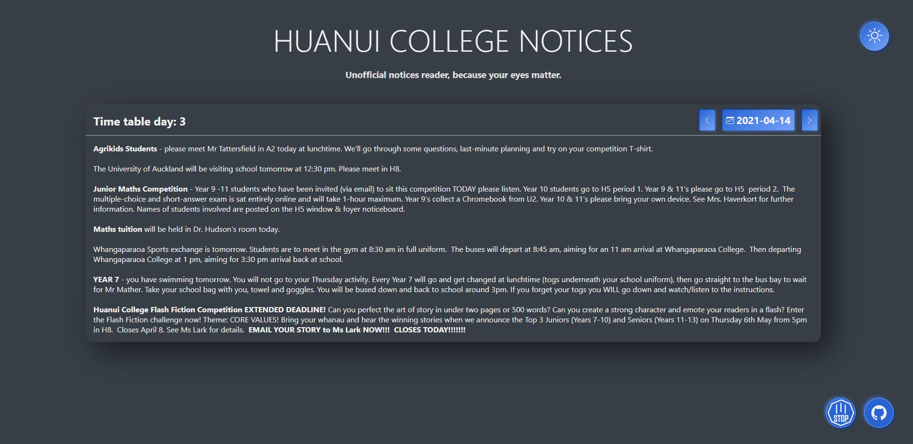

### Unofficial Huanui College daily notices reader, because your eyes matter.

 

> #### [Github: https://github.com/Fallstop/HCNoticeReader/tree/v1](https://github.com/Fallstop/HCNoticeReader/tree/v1)

> #### [Website: https://v1.hcnoticereader.pages.dev](https://v1.hcnoticereader.pages.dev)

 

## Framework

This static "webapp" is built in [Svelte](https://svelte.dev/), and leans of my previous [HC Api Gateway](/projects/hc-tools). This is my first time using Svelte, and it has been great, like most of my other sites, it exports directly to static to be hosted on Cloudflare's CDN for free.

## Why
My school, Huanui College has a really bad habit of putting everything into google calendars. Which means that every student needs to read the notices everyday in an experience roughly resembling this:

When it could be this:

The other inspiration of this site is that I wanted to learn Svelte, and this was exactly the *tool for the job*

## Design

The design was focused on maximizing comfortable reading on all devices, environments and preferences. This meant focusing on a simple layout that could respond well to mobile users. This is also my first time experimenting with Neumorphism I also added a toggleable dark mode, which defaulted to the users device settings.