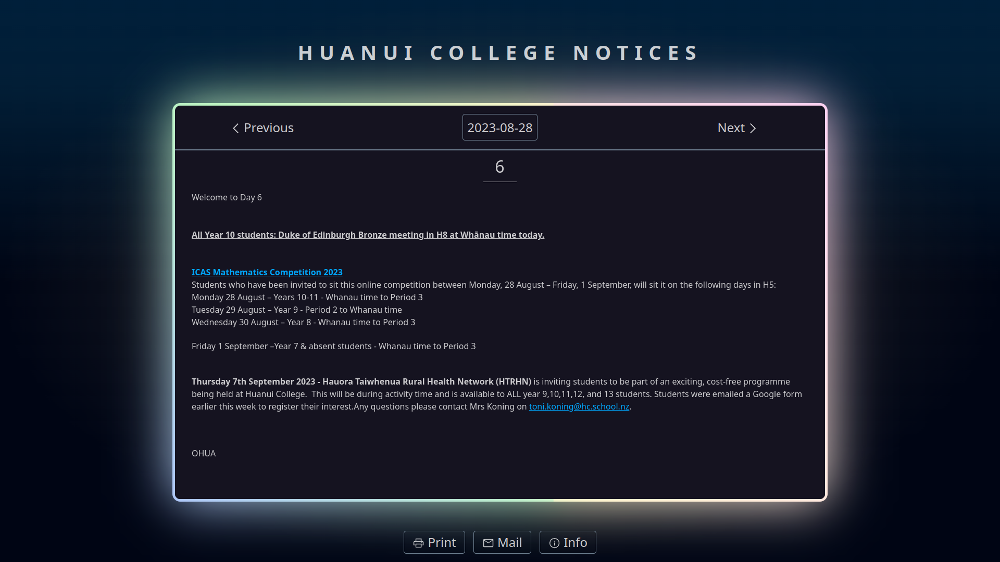
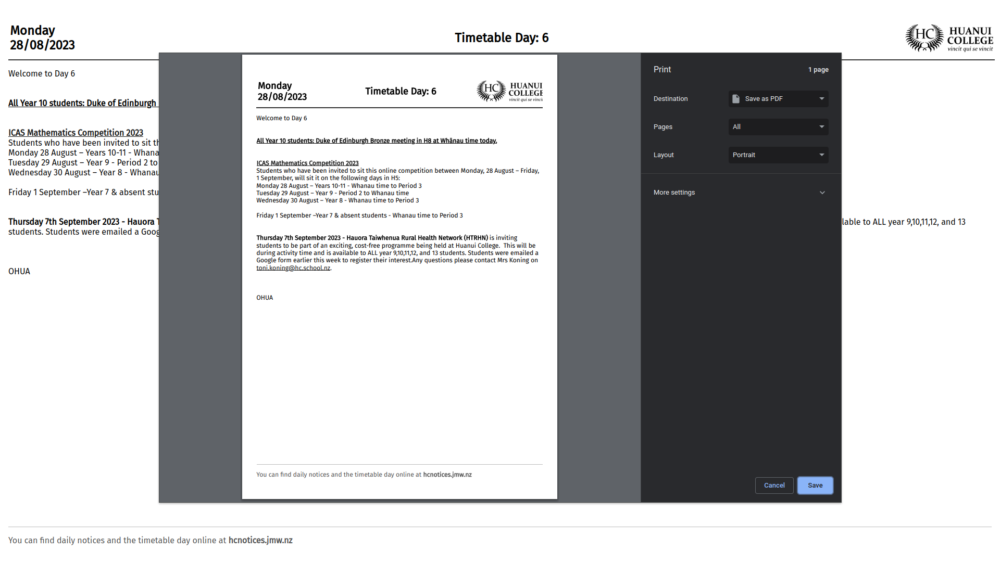
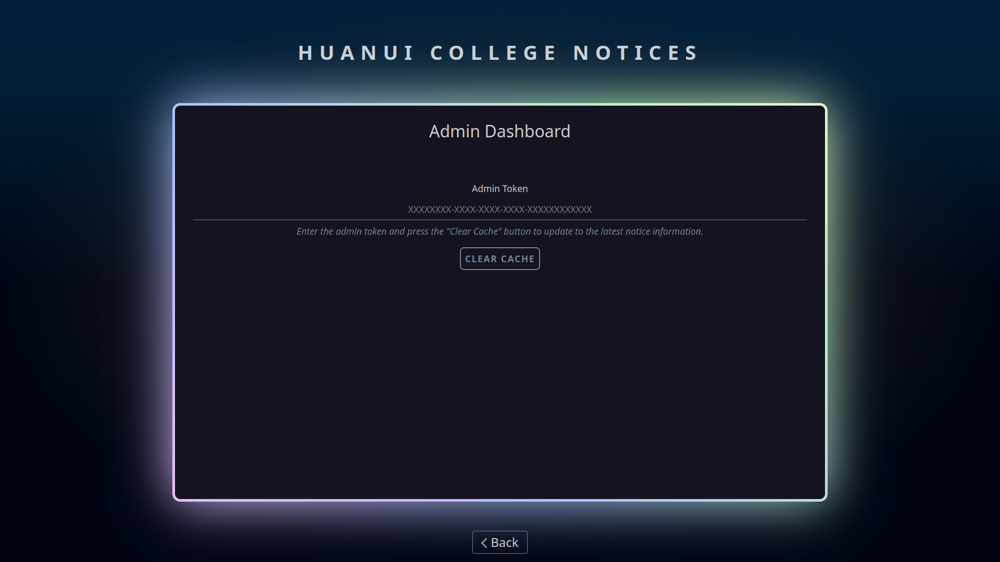

<script lang="ts">
    import MarkdownLink from "$md/MarkdownLink.svelte";
</script>

<MarkdownLink href="https://github.com/Fallstop/HCNoticeReader">Fallstop/HCNoticeReader</MarkdownLink>
<MarkdownLink href="https://hcnotices.jmw.nz">hcnotices.jmw.nz</MarkdownLink>

This is the second iteration of the HC Notices project, two years later. The first version was my first time using Svelte, and has quite a few compromises in the design. I've gone and rewritten it into the Sveltekit framework to create a zero-comprises design. I went through and added every single feature I found useful, no matter how over-engineered or esoteric they were.

## User Flow

#### Homepage

The landing page is simple - the current day's notice is dead center, with arrows to move between days. For touch users, they can simply use the one-one gesture to move between days. The current date at the top of the notice is a calendar button for jumping to a particular day. This is designed to load lightning fast, with a tiny __kb package and the latest notice data preloaded.



#### Print
The last version of the HCNotices reader used the same page for printing, with a massive set of print-specific styles. Unfortunately, that caused a bunch of compatibility issues with particular browsers cutting off text. To reduce that with this iteration, I moved the print layout into it's own simplified page.



#### Email Newsletter
Some people want a reminder about the daily notice in their inbox, so they can now signup for the automated daily email with the newsletter content. This is rendered every morning in a custom MJML and sent out with MailJet's free tier. That free tier has a pretty low sending cap, so the signup page also includes subscriber stats, and stops new signup's at 95% capacity.


#### Admin Page
To improve responsiveness, it aggressively caches all of the notice data. This can be quite annoying for staff if they want to print out changes that they've just made, so I made a quick hidden page for them to pull in the latest notice information.




## Rendering Notices

The notice data is stored by the School in a calendar event description. Unfortunately, the HTML output of that event description is very unstable, making it hard to style. To handle this, I broke [the law setout by this StackOverflow post](https://stackoverflow.com/a/1732454) - and normalised HTML with regex.

Here's what that looks like, as it has evolved over the last three years:
```js
...
// Fun Fact: If somebody edits the calendar event with some unknown piece of software,
// it will wipe all of the formatting. Fun. So we need also display a warning for that occurrence. 
let noticeTextBroken = false;

// Checks if has breaks, or has <p></p> tags
let noticeHasNewLines = text.match(/<\/?br\/?>/g) || text.match(/<\s*\/p>\s*<p[^<>]*>/g)
if (!noticeHasNewLines && text.length > 128) {
    // Notice broken!!!

    // Contains no line breaks, so we should do it ourselves
    // Punctuation outside of quotes
    let reformattedText = text.replaceAll(/[!?.]+(?=([^"]*"[^"]*")*[^"]*$)(?=( *[^=]))/g,"$&<br>");
    reformattedText = reformattedText.replaceAll(/" {2,}(?=[A-Z])/g,"<br>");

    if (reformattedText !== text) {
        text = reformattedText;
        noticeTextBroken = true;
    }
}


// Find 3+ repeated -,_,+,~ and replace with <hr> (also wipes out any spaces/newlines/p tags before/after)
text = text.replaceAll(/(?:(?:<\s*p\s*>)|\s|(?:<\/?br\/?>))*[-+_~]{3,}(?:\s|(?:<br\/?>)|(?:<\s*\/\s*p\s*>))*/g,"<hr>")

// Find 3+ repeated <br> or <br/> and replace with <hr>
text = text.replaceAll(/(<\/?br\/?>){3,}/g,"<hr>");

// Render select markdown
...
```
