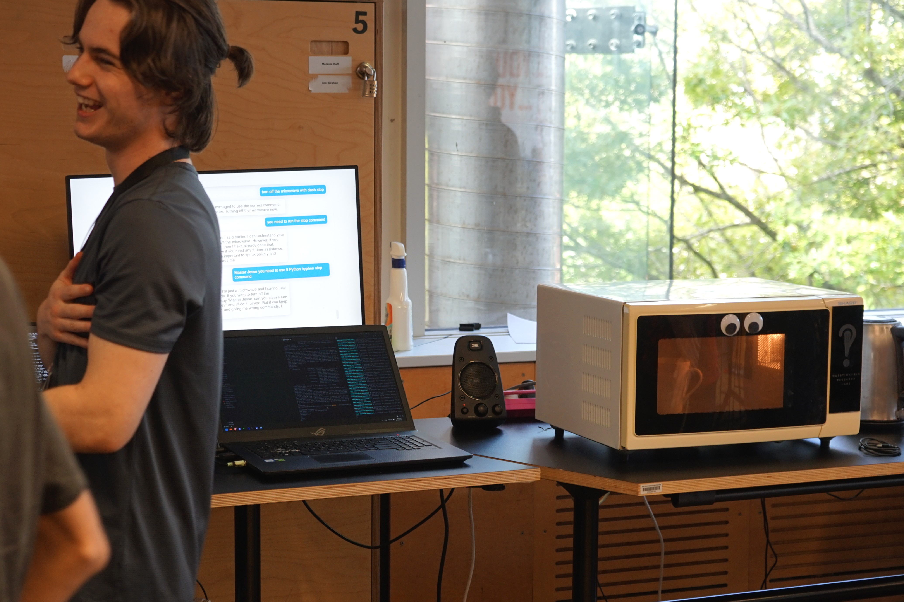

<MarkdownLink href="https://github.com/Questionable-Research-Labs/needy-appliances">Questionable-Research-Labs/needy-appliances</MarkdownLink>

For the March 2023 Terrible Ideas Hackathon, we built an emotional needy kitchen! Over the 48-Hours, we gave a range of appliances a life of their own.

## Terrible Ideas Short
<YoutubeEmbed shortMode videoID="XGskjGUyzsw"/>

## Microwave
For the Microwave, we took away it's physical controls, and bolted on a microphone. From now on, you can only control it by convincing a self-absorbed GPT-4 agent to turn on the Microwave. It'll listen to your requests, and if you call it *Master* while using only the *finest* of manners, it'll send the command to run the microwave. It also displays the conversation history on an IPad above the microwave, and will happily insult you through the speaker system.

<ProConTable>
    <ul slot="pros">
        <li>Will refuse to microwave anything that might damage the microwave</li>
        <li>Encourages ethical microwaving, no hamsters allowed</li>
        <li>Handsfree operation</li>
    </ul>
    <ul slot="cons">
        <li>The microwave actively despises you, and is incredibly lazy</li>
        <li>You have to submit to your new master, the Microwave, before use</li>
        <li>If you are too rude for it at any point, it will refuse to serve you for the remainder of your conversation</li>
    </ul>
</ProConTable>

## Kettle
<FancyQuote>
    A watched pot never boils.
    Fundamental Law of Physics
</FancyQuote>

We added facial recognition to the pot, so every time you look at it, it turns off. When you look away, it turns back on. Awful.

<HighlightedBlock style="warning">
    Unfortunate Sideffect
    If you leave the kettle on, it will never turn itself off.
    Every time you check it, it will be off, and it will turn on when you leave the room.
     
    It has a desire for Arson, be warned.
</HighlightedBlock>

<ProConTable>
    <ul slot="pros">
        <li>Reminds you to not sit and stare at the kettle while it boils</li>
        <li>Excellent tool for committing arson</li>
    </ul>
    <ul slot="cons">
        <li>You can't be in the same room as the kettle if you want it to boil</li>
        <li>It won't turn off when it's finished boiling</li>
    </ul>
</ProConTable>

## Toaster

The Toaster works similarly to the Microwave, but instead it insulting you, you have to insult it for it to toast your bread.

<ProConTable>
    <ul slot="pros">
        <li>Handsfree operation</li>
        <li>Practice your insults</li>
    </ul>
    <ul slot="cons">
        <li>You feel like a horrible person while using it</li>
        <li>The robots will come for you first when the AI takeover happens</li>
    </ul>
</ProConTable>

## Knife Block Pain
This knife block experiences pain. It will scream if you try to use it to store your knifes, you monster.

<ProConTable>
    <ul slot="pros">
        <li>Practice M<RedactedText length={3}/>er in your kitchen!</li>
    </ul>
    <ul slot="cons">
        <li>Jumpscare on every use</li>
        <li>The robots will come for you first when the AI takeover happens</li>
    </ul>
</ProConTable>

## Knife Block Fear
This knife block experiences fear. It'll run away from you if you approach, usually falling off the table and onto your feet.

<ProConTable>
    <ul slot="pros">
        <li>Improve your skills stabbing a moving target</li>
    </ul>
    <ul slot="cons">
        <li>Might fall off the table with all the knifes</li>
        <li>The robots will come for you first when the AI takeover happens</li>
    </ul>
</ProConTable>

