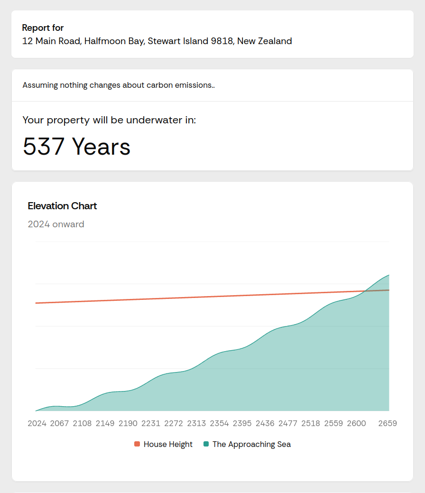

<MarkdownLink href="https://2024.hackerspace.govhack.org/projects/what_s_your_ocean_tax">Govhack Project</MarkdownLink>
<MarkdownLink href="https://water.haxx.nz/">water.haxx.nz</MarkdownLink>
<MarkdownLink href="https://github.com/govhack-2024/Report-card">Questionable-Research-Labs/
Report-card</MarkdownLink>
<MarkdownLink href="https://youtu.be/RBtr1msbol8">Presentation Video</MarkdownLink>

Taking the latest scientific data on sea-level-rise, vertical land movement, and localised tidal data, we extrapolated out a few thousand years. 

## The land is sinking rapidly in upper Wellington

## Although the land itself is rising in Stewart Island

<YoutubeEmbed videoID="RBtr1msbol8"/>

