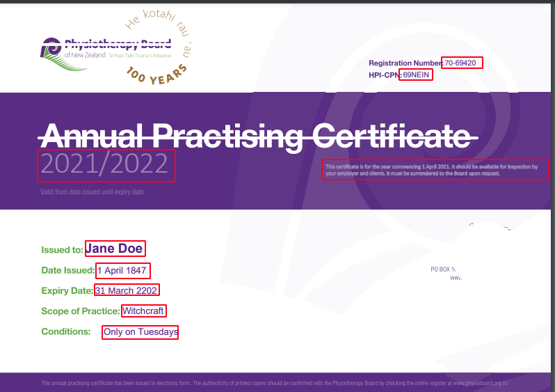

**Automatically extracting info from certificates**

#### Links
 - Github: [openhealthnz-credentials/physioboard-apc-reader](https://github.com/openhealthnz-credentials/physioboard-apc-reader)
 - NPM: [physioboard-apc-reader](https://www.npmjs.com/package/@openhealthnz-credentials/physioboard-apc-reader)
 - Demo: [Svelte Demo](https://physioboard-apc-reader.pages.dev/) ([server source](https://github.com/openhealthnz-credentials/physioboard-apc-reader/blob/main/lambda-service/index.js)) ([client source](https://github.com/openhealthnz-credentials/physioboard-apc-reader/tree/main/demo-site))
 - [Sample PDFs](https://github.com/openhealthnz-credentials/physioboard-apc-reader/tree/main/samples)
 - Sponsor: [Provida](https://www.provida.nz/)


At it's core, it's a typescript library that can read selected fields from the Annual Practising Certificate (PDF document) issued by the Physiotherapy Board. This is a tiny library, but this parser is a proof of concept for a future library that would have wide support for many different medical certificates.

### Physiotherapy Board APC Analysis

The certificate is a common PDF v1.7, produced off a template with text boxes pasted in at the right places using the official Adobe SDK.
Interestingly, the template only has the dynamic text as "text", while the rest seems to just be SVG's. This makes it much simpler to extract text using the PDF standard, as this is what a PDF Text Extractor library sees:



With OCR, all the text would be detected, and might require cropping to just the areas wanted.

Another interesting part is that it uses the Adobe protection, with AES-256. This means that in its PDF form, it would need a relatively new version of PDF.js to work.

### OCR vs PDF Text Extraction

There are two choices when wanting to extract info from a Certificate, OCR or PDF Text extraction.

**OCR**
 - Pros:
   - Works for both an scan or the original PDF
 - Cons:
   - Less reliable for character recognition, especially with non-ascii characters
   - Includes all text on the PDF, not just the relevant text

**PDF Text Extraction**
 - Pros:
   - No chance of non-ascii characters preventing scanning
   - Includes all text on the PDF, not just the relevant text
 - Cons:
   - **Only** works with the original PDF

### Implementation

I went with the direction PDF Text Extraction, specifically using the [pdf-parse](https://www.npmjs.com/package/pdf-parse) library. This earlier example looks like this when processed:

```markup
2021/2022
This certificate is for the year commencing 1 April 2021. It should be available for inspection by 
your employer and clients. It must be surrendered to the Board upon request.
70-69420
69NEIN
Jane Doe
1 April 1847
31 March 2202
Witchcraft
Only on Tuesdays
```

From here it's pretty simple to use regex to parse and validate the data, as done in [this function](https://github.com/openhealthnz-credentials/physioboard-apc-reader/blob/ea4a3075abb0e3bec86f060d79d90f0d8ebfe7e2/src/certProfiles/physioboardAPC.ts#L16).