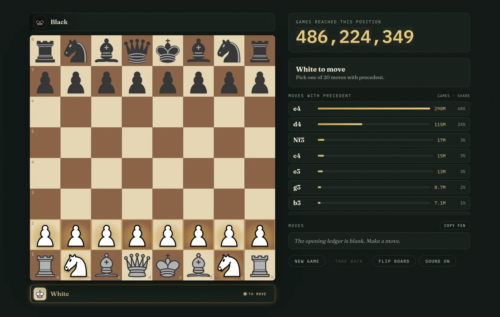
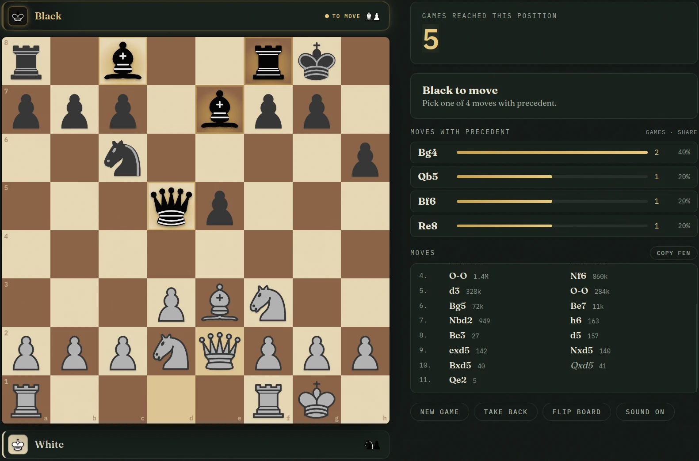
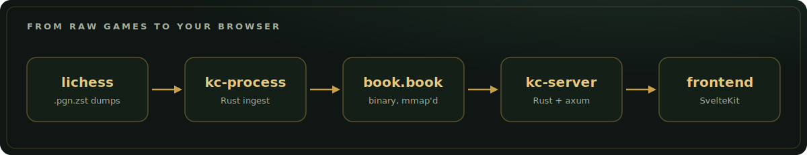
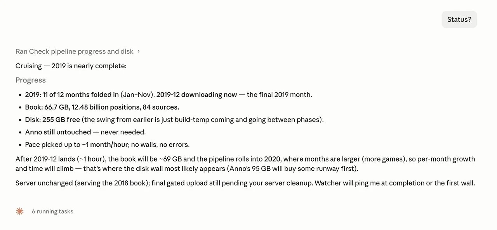

<script>
    import MarkdownLink from "$md/MarkdownLink.svelte";
    import ogCard from "./concept.webp?normal&url";
</script>

<MarkdownLink href="https://precedent.jmw.nz">precedent.jmw.nz</MarkdownLink>
<MarkdownLink href="https://github.com/Fallstop/known-chess">Fallstop/known-chess</MarkdownLink>



## One rule

Precedent Chess is normal chess with a single extra rule: **every move needs a precedent**. You can only play a move if someone, somewhere, has already played it from your exact position in a real game.

Open the board and White has 20 legal first moves, same as always. The difference is that each one now carries a number: how many of the roughly 486 million games on record actually played it. `e4` has 290 million precedents. `d4` has 115 million. Play `a3`? Sure, plenty of people have. Wander into `Nh3` and you are in rare but real territory, walking a path only a few thousand games ever took.

The catch is what happens next.

## The precedent runs out

Every move you make narrows the set of games that still match your line, and the counts crater. A few moves in, the millions become thousands. A dozen moves deep, you might be one of a handful of people in history to have stood in this exact position.



And then it happens: only **one** game ever reached here. A single legal move is left, the one that game played, so the line stops being a choice and **plays itself out to the end**. You become a passenger on a single real game from some stranger's Tuesday-night blitz session, watching it finish itself. I only keep games that ended on the board (a real checkmate or stalemate, no resignations or flag falls), so every line is guaranteed to reach a genuine result. Land on the ending and you can open the original game on Lichess and see exactly whose game you had been finishing.

## Where the games come from

Every precedent in the game is a real game from [Lichess](https://lichess.org), the free, open-source chess server. It is one of the two biggest chess sites in the world, it runs as a non-profit with no ads, and, perfectly for a project like this, it gives everything away.

The [Lichess open database](https://database.lichess.org) is the entire history of the site: every rated game played since 2013, published month by month as compressed PGN and released into the public domain under CC0. It is the largest free chess dataset anywhere, somewhere north of 2.5 TB compressed and well over a hundred billion moves, growing by a few hundred million games every month.

That archive is the raw material. Precedent Chess never asks Lichess for anything live; it just distils the whole dump down to one question it can answer instantly: from this exact position, what did real games do next?

## How it works

Underneath, the whole thing is a lookup. Every position gets boiled down to a 64-bit [Zobrist hash](https://en.wikipedia.org/wiki/Zobrist_hashing), and the book is one enormous sorted table of `hash -> [(move, count)]`. A lookup is a single binary search; the server mmaps the file and answers straight out of the page cache. Two openings that reach the same position collapse onto the same hash for free.



The frontend runs a full chess engine in your browser and, for every position, just asks the server which moves are still on record:

```
GET /api/lookup?fen=<position>

{ "fen": "...", "total": 2, "moves": [ { "uci": "e2e4", "san": "e4", "count": 2 } ] }
```

`total` is how many games ever reached this position; the counts are how those games split from here. Once a single move is all that is left, the line is forced and plays itself. The whole format is tuned for the fact that almost every position has been seen exactly once, with one continuation, so it lands at about 6 bytes per position: billions of positions squeezed small enough that a cheap server can hold the book open in memory and read it without parsing a thing.

## The book builds itself

That 2.5 TB does not fold itself into a book. Pulling down each monthly dump, parsing hundreds of millions of games and merging them in is a long, fragile, days-long job. It is the kind of thing I used to babysit by checking in every few hours and leaving the weekend runs to hopes and prayers.

This time I handed the whole pipeline to Claude Code and let it run.



Modern coding agents have gotten genuinely good at the boring half of this: waiting on a command for hours and reacting when it breaks. So when the build hit a wall, it dealt with it:

- **Out of disk?** Clear the dumps already folded into the book, and if that is not enough, raid my Steam library for space. Sorry Anno 1800, you are first on the chopping block (though, as the screenshot smugly notes, it never came to that).
- **Almost out of memory?** Quit cleanly, rework the build to spill to disk past a ceiling, and resume from the last checkpoint.
- **Rate-limited?** Detect it and pick up exactly where it left off.

A well-designed pipeline can pause and resume itself in an emergency. A bodged-together one, left in the hands of an agent, just patches itself when it hits a wall.

Is this secure? Not even slightly. I gave an autonomous agent broad access to my machine and the freedom to delete things, my own games included. It was also gloriously convenient.

## Try it

It lives at [precedent.jmw.nz](https://precedent.jmw.nz). Open with `1. e4` like a reasonable person, or play `1. Nh3 2. Rg1` and go spelunking for the loneliest checkmate in recorded history. The whole thing, the Rust ingest and server and the SvelteKit frontend, is open source on [GitHub](https://github.com/Fallstop/known-chess).

<a href="https://precedent.jmw.nz" target="_blank" rel="noopener" style="text-decoration:none">
  
</a>
