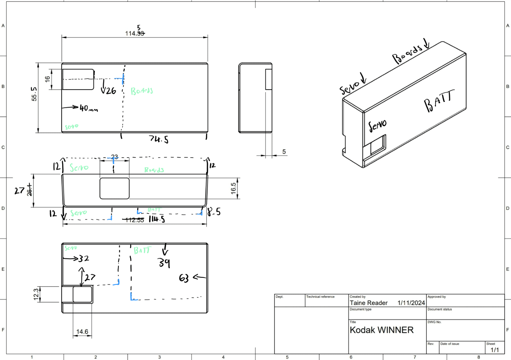
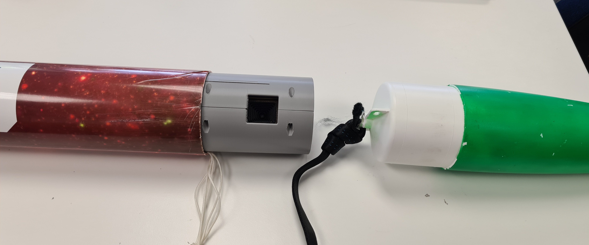
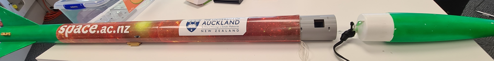
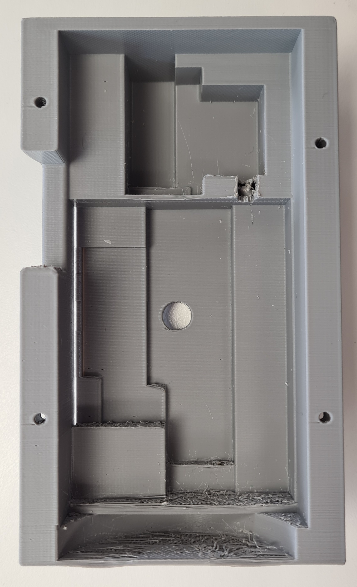
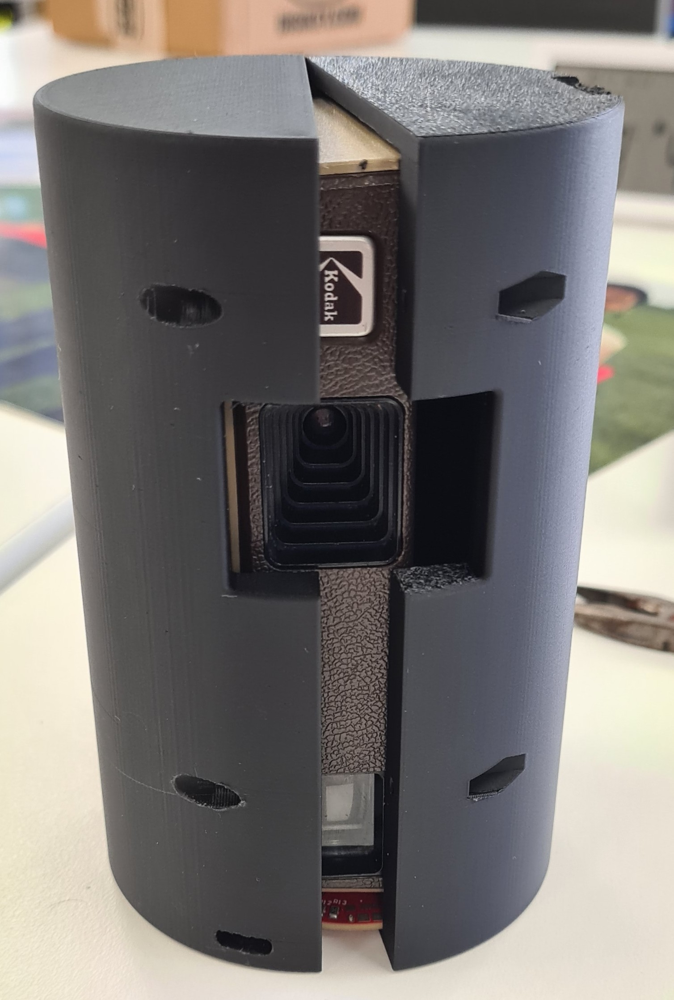
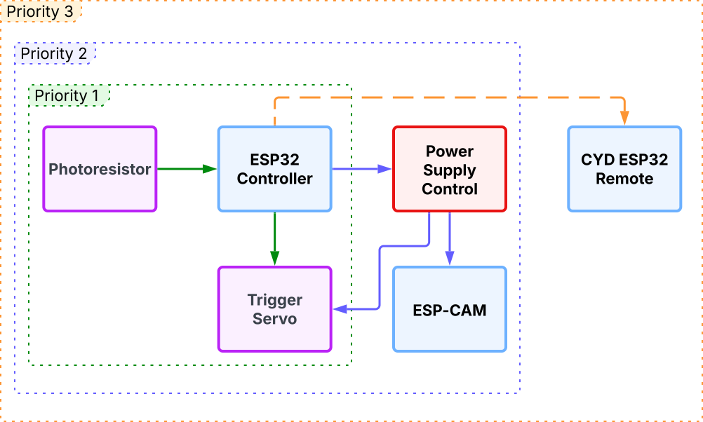
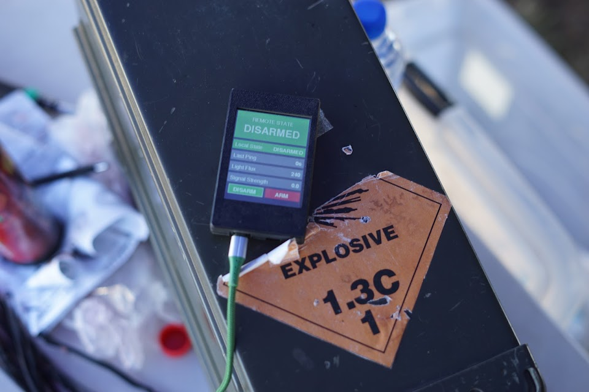
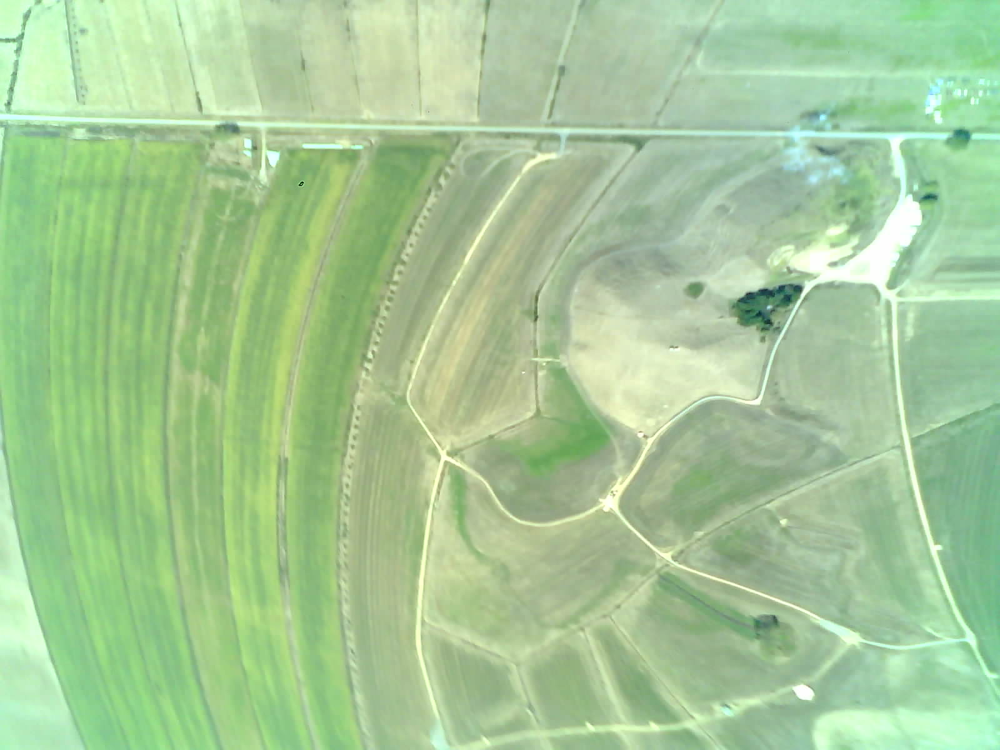
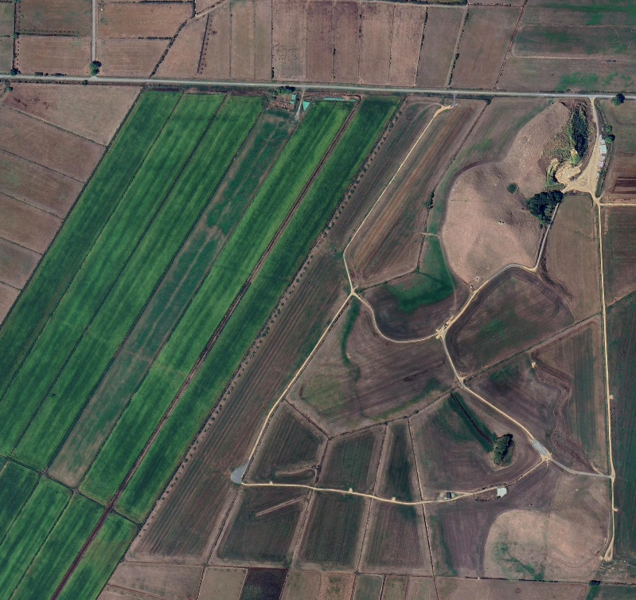

<MarkdownLink href="https://photos.app.goo.gl/4VSRH3fttHpKH7LG9">Full Photo Album</MarkdownLink>
<MarkdownLink href="https://github.com/questionable-innovations/QSAT_2024-2025">Questionable-Innovations/QSAT_2024-2025</MarkdownLink>
<MarkdownLink href="https://apss.co.nz/">PSAT</MarkdownLink>

## We launched a film camera in a rocket in 2025.
With modern electronics, advanced cad, and the latest 3D printing technology, we managed to capture an entirely white film frame.
This is the cool story of how we managed to capture perhaps the most boring photo possible.

<TodoMark>replace with actual film photo that'll have texture to it, right now it looks like it's stuck loading</TodoMark>

## What is PSat?
PSat is a summer program run by the [Auckland Program for Space Systems (APSS)](https://apss.co.nz/) at the University of Auckland. The program is designed to give students hands-on experience in building and launching a small "pico-satellite" payload. The payload can be anything the students like, as long as it's self-contained, and fits into the I class rockets ([Sudden Rush](https://locprecision.com/products/sudden-rush)) provided by APSS.

Many teams are formed, which are filtered down through design reviews and checkpoints to a final few teams that get launched at the end of the program. The design reviews are loosely based on a simpler version of NASA's mission lifecycle.

Every team also had access to reference designs, which were provided by the APSS team. These reference PCB's were designed to vertically stack, and covered the basic functionality needed for a PSat. The reference designs included a battery powersupply, a MSP430 based MCU board, and a beacon board with a LoRa radio, GPS, and a buzzer.

This year, the teams were provided with the following theme:
> ### Create a superlative PSat.
> Your PSat must be the best at something. It can be the fastest, the most powerful, the most efficient, or the most fun. 

## The concept

To fit the theme, we select "The Most Retro" as our superlative. We decided to build a payload that would take photos on deployment using a commerical film camera. Alongside the film camera, we wanted to include a small digital camera, and a sensor/communication module to send telemetry data back to the ground.

The payload must fit into a tiny space, around the , so we needed a tiny film camera to match. We settled on the [Kodak Winner Pocket Camera](https://filmphotographyproject.com/kodak-winner-110-pocket-camera-review/), a small 110 film camera that was one of the [official sponsors of the 1988 Olympic Games](https://collectiblend.com/Cameras/Kodak-Eastman/Winner-Camera-(1988-Olympics).html). The camera is small, light, and dead-simple to operate. It has a fixed focus lens, a fixed aperture, and a fixed shutter speed. The only thing we needed to automate was the shutter release & film advance.

#### Mission Definition Review

Once we had our concept, we needed to present it to the APSS team for approval. It was a simple presentation, where we outlined our concept, the components we would use, and the timeline for the project. We also outlined the risks and challenges we would face, and how we would mitigate them. The presentation was well received, and we were given the green light to proceed with the project.

## First iteration

Once we had the green light, we started to design our payload. Both the mechanical team and the electrical team started to work on the first prototype from both ends, working towards the Preliminary Design Review deadline. The mechanical team started to design the payload structure, while the electrical team started to design the electronics. We also started to source the components we would need for the project.

### Electrical

Despite the very analog nature of the film camera, we needed a full electrical subsystem to act as our flight computer. Not only did it need to detect and trigger the film camera at apogee, we also aimed to dynamically advance the film frame, trigger a digital camera to capture matching shots, and even record & broadcast flight information over a LoRa radio. Ambitious plans indeed.

Due to the mechanical constraints below, we had super limited space for the onboard flight system. Unlike most other teams, we couldn't just design an extension to the example PCB designs, as they were designed to stack, using up our precious vertical space within our PSAT. To make more space for the camera itself, we decided on a long motherboard like design.

> Mechanical diagram should go here? Something to show where the Motherboard was inside the PSAT

To start, we merged the MCU & Beacon example PCB's into one schematic, and began work in Altium. We had a heap of features to integrate.

### Motor control system
Unfortunately our film camera was designed for humans to operate, not robots. The trigger was simple to operate, a simple push-button mechanism the fired the fixed shutter. The film advance mechanism on the other hand, was another beast. To advance the frame, you had to slide the flat mechanism back and forth until it jams. Sometimes you could drag once, sometimes you needed to drag three times for a single shot. It's simple for a human with eyes, who can see the thing, but hard for a robot trying to tell by feel.

In a bid to keep things as simple as possible, we decide to use a servo for the shutter trigger, and a current sense motor combo for the film advance. The current going through the motor will peak when the motor stalls, we can *theoretically* find our three jam states from a single sensor.

For implementing, we decided on using an SG-90 servo for both the trigger and film advance, simply modding the latter to turn it into a geared down DC motor. To sense the current, we just needed a nice little bit of first-year opamp analysis to calculate a circuit to measure current.

After all, if it didn't work, we always had the next iteration to get it right.

### Mechanical Constraints
The payload must fit within the I class rocket, Sudden Rush, as mentioned before. The airspace that can house the payload has a maximum height of 125 mm and a maximum width/diameter of 74 mm. This airspace must also have room to hold the parachute when it's not being deployed. The payload must also eject out from the rocket freely after reaching apogee.

Our payload had a maximum height of 125 mm and maximum width/diameter of 74 mm because we wanted to utilise as much of the airspace as we could. This was primarily due to the film camera taking up the majority of the space inside our payload as its dimensions were 114.512 mm x 55 mm x 26.1 mm. Therefore, we could only place the camera right down the middle of the payload to maximise the space we could use around the camera. The remaining space surrounding the camera allowed us to fit the two servo's we had planned to use as well as the custom PCB and the PSU board. 

As a result of us maximising the rocket tube's airspace, we had to come up with an idea on how we could attach the parachute to our payload. Since we weren't able to attach a mount on the top or bottom end of our payload, we decided to mount our parachute on the side of the payload, not through an external mount. We had enough space inside the payload that we could make a small channel that allowed us to feed the parachute strap through. 
<TodoMark>Photo showing the ingenious strap mount</TodoMark>

#### Version 0
'Version 0' was our inital proof-of-concept to make sure our film camera could fit inside our allocated payload size. We 3D printed a cylinder with the area for the camera cut out of the inside. The benafits of doing this allowed the whole team to get an idea of area around the camera we have to work with, and with the CAD model we could start allocating space for different elements.
<TodoMark>Photo of V0 (White design) </TodoMark>

#### Version 1
 

With version 1 we began exploring size and placement of elements. We knew roughly what elements were going into the payload, so we were able to cut out the space for them. This allowed us to expore wether the internal structure would hold with so much material cut out. This included performing drop tests and general structural tests. 
Another element that was explored was how we can open & close the payload. This problem is nontrivial as the payload must retain its outer cylindrical form, and a top cap could not be used as the internal structure of the payload could not all be accessed. So the idea for a clamshell mechanisim was tested. The payload shell was split vertically, with holes to allow 4 bolts to hold the shell together. Another benafit of this design was, with the camera removed, all internal electronics were easilly accessable to run wires. 

#### Version 2

<TodoMark>Needs Organising</TodoMark>

<TodoMark>Explain changes from v1 to v2</TodoMark>
Airspace surrounding the space where the servos would go were expanded for allowing a better fit of the the servos.
Airspace created at the base of the interior of the shell to allow for placement of the PSU board.
Cutouts were made in front of the location where the film camera lens were going to look out from. Cutout also made for the ESP-32 Cam lens to look out through.

After attempting to place the servos into their dedicated spot, the airspaces were found to still be too tight. Modifications were temporarily made by removing some of the supporting walls inside using a scalpel.

#### Version 3

<TodoMark>Explain changes from v2 to v3</TodoMark>
Version 3 were 3D printed with larger airspaces for the servos.

<TodoMark>Photos of changes from v2 to v3? + photo(s) of v3? (Black)</TodoMark>

#### Version 4
<TodoMark>Explain changes from v2 to v3</TodoMark>
Version 3 were 3D printed with larger airspaces for the servos.
<TodoMark>Photos of changes from v2 to v3? + photo(s) of v3? (Orange)</TodoMark>

#### Version 4.5
Due to the sudden demise of our custom PCB one week before launch day, we had to scope-down our setup to use a single [ESP32 S2](https://www.wemos.cc/en/latest/s2/s2_mini.html) as the core. This meant we had to change interiors of the shell that was designed to house the custom PCB, to now house a series of individual modules jankily wired together. 
<TodoMark>Explain changes from v3 to v4</TodoMark>
One half of the Version 3 shell had to be changed.
<TodoMark>Photos of changes from v3 to v4? + photo(s) of v4(Blue Half in APSS)</TodoMark>

### Electrical fail

#### Preliminary Design Review

The first design review was held on the 1st of December 2024. We presented our concept to the APSS team, and received feedback on 

## Second Iteration

### Critical Design Review

### Electrical fail

## Third Iteration

### The rebuild

So ... we don't have a controller. We're supposed to **launch in four days**. This is where our Hackathon experience came in handy.

We split our goals into three sequential scopes:

Priority one was simple. It would simply wait until the payload was ejected into the bright sunlight, then push down the trigger on the film camera. This was the MVP that if functional in time, would make it worth the time to launch the payload.

The next scope, priority two, added a digital camera and power management to the design. Upon ejection from the rocket body, it would enable the 5V rail on the power supply. This would both enable the Servo, and power up the ESP-CAM. The ESP-CAM would take as many photos as possible on boot, and save to the included SD card.

Finally, as our stretch goal in priority three, we wanted remote arming. As we only had a single shot, the worst case scenario was our payload activating prematurely and wasting the film. If we're constantly looking for light, we would have to arm the payload, and assembly the rocket without any light leaking into the payload.

This is why we choose an ESP32 as the core MCU at the start, as this enabled us to easily communicate over [ESP-NOW](https://www.espressif.com/en/solutions/low-power-solutions/esp-now) using the built in antenna. Along with a [Cheap-Yellow-Display](https://github.com/witnessmenow/ESP32-Cheap-Yellow-Display?tab=readme-ov-file#esp32-cheap-yellow-display) on hand.

*Spoilers: We managed to get all of these working, and the remote looks amazing. Take a look:*

## Launch Day

## Recovery

## Photos captured
 

### The blank photo mystery

<TodoMark>This should basically be yeeted</TodoMark>

The first few photos for both cameras, were somehow completely blown-out. There are a couple of theories behind this:

#### Exposure adjusted to inside the rocket
It's completely pitch-black inside of the rocket, so the exposure could've been completely blown out by the time it left the rocket.
- This doesn't explain the white frame from the film camera, as it had a set exposure. *mention the fixed set or will it be explained in a different section, i.e. maybe one tht mentions the firmware side of this project?*
- The digital camera would've turned on outside the rocket itself.

#### The cameras were pointing at the sun
Neither would cope with pointing at the sun, which would completely blow out any photos. However, the cameras theoretically took photos at roughly the same time, and they were 90 degrees offset from one another.

#### The smoke from the rocket obscured the view
The separation charge didn't seem to create much smoke, but it could possibly have obscured a photo - but two digital photos (one whole second apart!) were both blank, so this doesn't seem likely. 

#### It separated inside of a cloud
The low clouds present would reflect more than enough light to overwhelm both the fixed shutter of the film camera, and the exposure adjustment of the digital camera. We don't believe it separated anywhere near the minimal clouds present. 

### The real cause?
We still don't know. We had some more random theories, such as the ejection charge triggering the film camera and overexposing the film at the same time, but to this day we still don't know what truly caused it. The most probable answer is probably the simplest: The body was rotating at high speeds, enough for the sun to blow out both the film photo and the first two digital photos. This speed can be seen in the first few non-blank digital photos, before it got settled into a more stable fall.

Here's the first non blank photo, along with the satellite imagery of the location, so you can see the speed for yourself.

