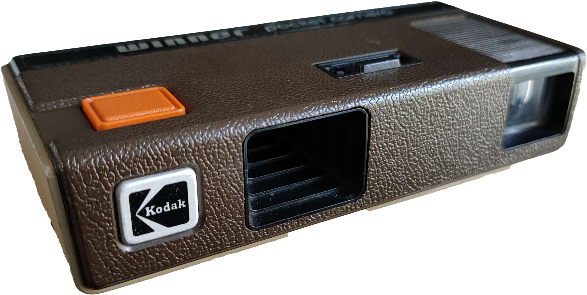
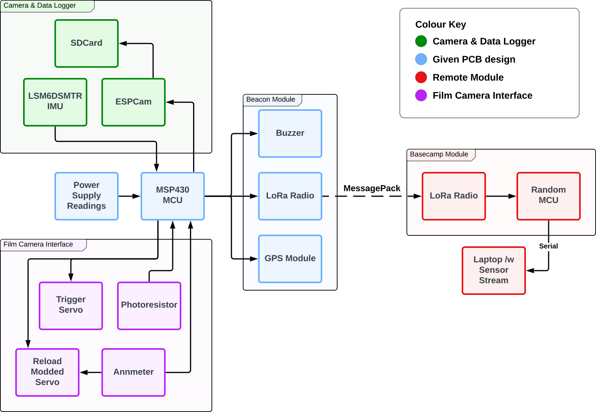

<MarkdownLink href="https://github.com/questionable-innovations/QSAT_2024-2025">Questionable-Innovations/QSAT_2024-2025</MarkdownLink>
<MarkdownLink href="https://apss.co.nz/">APSS</MarkdownLink>

## What is PSat?
PSat is a summer program run by the [Auckland Program for Space Systems (APSS)](https://apss.co.nz/) at the University of Auckland. The program is designed to give students hands-on experience in building and launching a small "pico-satellite" payload. The payload can be anything the students like, as long as it's self-contained, and fits into the I class rockets, [Sudden Rush](https://locprecision.com/products/sudden-rush) , provided by APSS.

Many teams are formed, which are filtered down through design reviews and checkpoints to a final few teams that get launched at the end of the program. The design reviews are loosely based on a simpler version of NASA's mission lifecycle.

Every team also had access to reference designs, which were provided by the APSS team. These reference PCB's were designed to vertically stack, and covered the basic functionality needed for a PSat. The reference designs included a battery powersupply, a MSP430 based MCU board, and a beacon board with a LoRa radio, GPS, and a buzzer.

This year, the teams were provided with the following theme:
> ### Create a superlative PSat.
> Your PSat must be the best at something. It can be the fastest, the most powerful, the most efficient, or the most fun. 

## The concept

To fit the theme, we select "The Most Retro" as our superlative. We decided to build a payload that would take photos on deployment using a commerical film camera. Alongside the film camera, we wanted to include a small digital camera, and a sensor/communication module to send telemetry data back to the ground.

The payload must fit into a tiny space, around the , so we needed a tiny film camera to match. We settled on the [Winner Pocket Camera](https://filmphotographyproject.com/kodak-winner-110-pocket-camera-review/), a small 110 film camera that was one of the [official sponsor's of the 1988 Olympic Games](https://collectiblend.com/Cameras/Kodak-Eastman/Winner-Camera-(1988-Olympics).html). The camera is small, light, and dead-simple to operate. It has a fixed focus lens, a fixed aperture, and a fixed shutter speed. The only thing we needed to automate was the shutter release & film advance.

#### Mission Definition Review

Once we had our concept, we needed to present it to the APSS team for approval. It was a simple presentation, where we outlined our concept, the components we would use, and the timeline for the project. We also outlined the risks and challenges we would face, and how we would mitigate them. The presentation was well received, and we were given the green light to proceed with the project.

## First iteration

Once we had the green light, we started to design our payload. Both the mechanical team and the electrical team started to work on the first prototype from both ends, working towards the Preliminary Design Review deadline. The mechanical team started to design the payload structure, while the electrical team started to design the electronics. We also started to source the components we would need for the project.

### Electrical

Despite the very analog nature of the film camera, we needed a full electrical subsystem to act as our flight computer. Not only did it need to detect and trigger the film camera at apogee, we also aimed to dynamically advance the film frame, trigger a digital camera to capture matching shots, and even record & broadcast flight information over a LoRa radio. Ambitious plans indeed.

Due to the mechanical constraints below, we had super limited space for the onboard flight system. Unlike most other teams, we couldn't just design an extension to the example PCB designs, as they were designed to stack, using up our precious vertical space within our PSAT. To make more space for the camera itself, we decided on a long motherboard like design.

> Mechanical diagram here

To start, we merged the MCU & Beacon example PCB's into one schematic, and began work in Altium. We had a heap of features to integrate.

### Motor control system
Unfortunately our film camera was designed for humans to operate, not robots. The trigger was simple to operate, a simple push-button mechanism the fired the fixed shutter. The film advance mechanism on the other hand, was another beast. To advance the frame, you had to slide the flat mechanism back and forth until it jams. Sometimes you could drag once, sometimes you needed to drag three times for a single shot. It's simple for a human with eyes, who can see the thing, but hard for a robot trying to tell by feel.

In a bid to keep things as simple as possible, we decide to use a servo for the shutter trigger, and a current sense motor combo for the film advance. The current going through the motor will peak when the motor stalls, we can *theoretically* find our three jam states from a single sensor.

For implementing,we decided on using an SG-90 servo for both the trigger and film advance, simply modding the latter to turn it into a geared down DC motor. To sense the current, we just needed a nice little bit of first-year opamp analysis to calculate a circuit to measure current.

After all, if it didn't work, we always had the next iteration to get it right.

### Mechanical constraints

### Electrical fail
#### Preliminary Design Review

The first design review was held on the 1st of December 2024. We presented our concept to the APSS team, and received feedback on 

## Second Iteration

### Critical Design Review

### Electrical fail

## Third Iteration

### The rebuild
### Trigger Panic
### The Remote

## The day itself

## Photos captured

## Recovery

