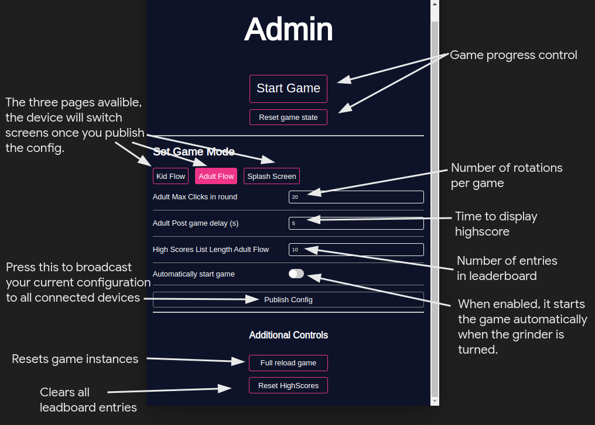
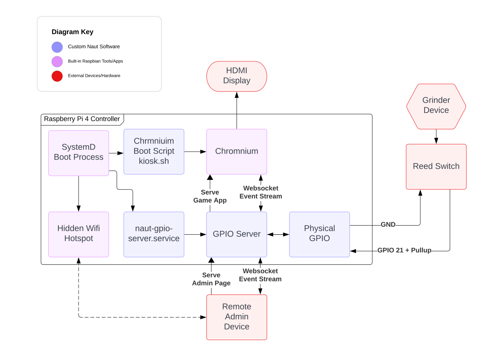

<MarkdownLink href="https://github.com/Fallstop/naut-grinder.git">Fallstop/naut-grinder</MarkdownLink>

A short deadline project developed for the Naut, a local E-Boat company, to use in an upcoming Festival. It had to be portable, reliable, and incredibly adjustable for changes on-the-day.

## Game Modes
### Non-Competitive

### Competitive

## Admin Page
The admin page can be opened on any nearby device connected to the management hotspot. In the admin portal, you can start the game, configure settings, and change game flows.

## Project Structure
### [Svelte Display](./svelte-display)
This is a embedded web app that displays the game state and allows the user to interact with the game. It is built using [Sveltekit](https://kit.svelte.dev/).
It connects to the game server using websockets, and has a remote management page.

### [GPIO Server](./gpio-server/)
This is a server that runs on the Raspberry Pi and relays the state of the pages to the embedded Page. Written in rust, it also acts as a communication relay between remote admin pages an the embedded Page.

## Hardware Diagram

