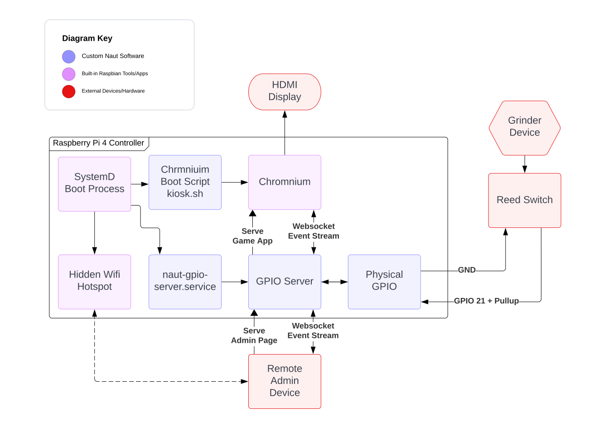

A short deadline project developed for the Naut, a local E-Boat company, to use in an upcoming Festival. It had to be portable, reliable, and incredibly adjustable for changes on-the-day.

## Hardware Diagram

## Game Modes
### Non-Competitive

### Competitive
