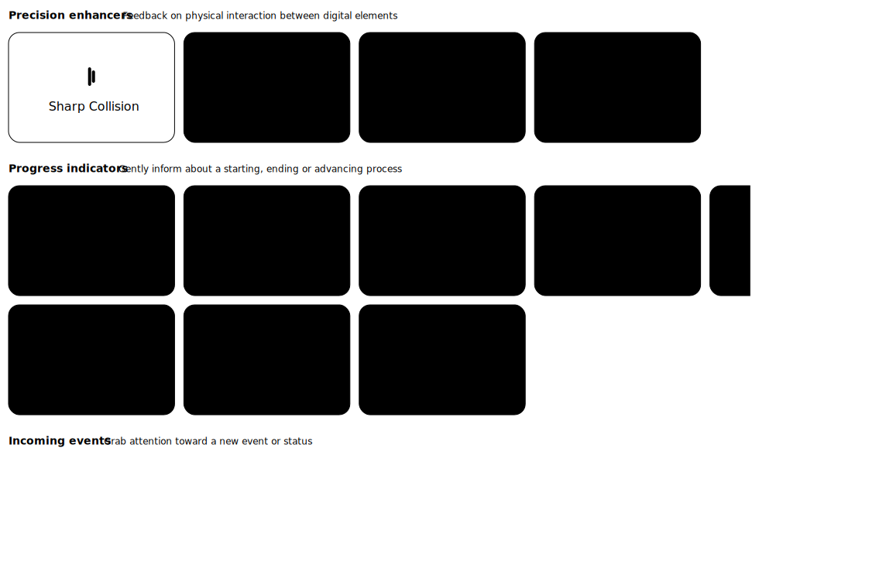

<script>
    import MarkdownLink from "$md/MarkdownLink.svelte";
</script>

<MarkdownLink href="https://haptics.jmw.nz">haptics.jmw.nz</MarkdownLink>
<MarkdownLink href="https://github.com/Fallstop/HapticWebPlugin">Fallstop/HapticWebPlugin</MarkdownLink>


## Haptic Feedback for the Web

A Logi Actions SDK plugin that exposes MX Master 4 haptic feedback via a local HTTPS server and WebSocket API.




## Why Haptics?

Every phone, game controller, smartwatch, and even my laptop's trackpad can now give nuanced tactile feedback… except the browser.

All we get is the Vibration API (wow, you can make the user's device buzz), which Mobile Safari still doesn't support and is still less capable than what hobbyists have achieved with WebHID game controllers. There is a lot to gain when micro-interaction feels like it clicks, drags, and snaps the same way the pixels do. The whole UI suddenly becomes more satisfying and real.

My new MX Master 4 mouse features a haptic motor, so I created a simple WebSocket bridge plugin to enable any website to send haptic events. Playing with it, I've found that any basic-ass slider feels satisfying to use when you can feel the bumps from each tick. Still, the mouse only provides 15 baked waveforms for you to use, with no control over intensity.

There's always the flip side, though. Remember what happened when we got push notifications: every site instantly weaponised them. Pop-up windows were so abused that every browser had to kill them with fire. If a real Haptics API ships with actual support, how long before an ad network starts serving "feel this deal!" vibrations on every load to harvest 2% extra attention?

It's likely that Haptics will never get the critical-mass attention for wide adoption, but dammit - I'm going to keep building with it.
<!-- Long-term view: will we look back at haptic-everything the way we now view 2020 neumorphic blob-buttons, or is tactile feedback the inevitable final layer of UX?

So, do we start pushing for a proper permission-gated Haptics API tomorrow, or is the web better off staying numb forever? -->

## How It Works

The plugin installs into Logi Options+ and runs a local HTTPS server on port 41443. Websites can then trigger haptic feedback through either a REST API or WebSocket connection.

### The local.jmw.nz Trick

One of the trickier parts was getting HTTPS to work locally. Browsers rightfully refuse to connect to self-signed certificates, and you can't just serve HTTP from a secure context. The solution: `local.jmw.nz` resolves to `127.0.0.1`, but with a valid SSL certificate that the plugin automatically downloads from GitHub. The cert gets cached locally and refreshed every 24 hours. You read that correctly, I'm shipping a valid SSL cert for my own domain straight to the browser.

### API Options

**REST API** for simple one-off triggers:
```bash
curl -X POST -d '' https://local.jmw.nz:41443/haptic/sharp_collision
```

**WebSocket** for lower latency when you need rapid feedback:
```javascript
const ws = new WebSocket('wss://local.jmw.nz:41443/ws');
ws.onopen = () => {
  // Send a single byte with the waveform index
  ws.send(new Uint8Array([7])); // "completed" waveform
};
```

### Available Waveforms

The MX Master 4 provides 15 built-in waveforms across different categories:

| Waveform | Index | Category |
|----------|-------|----------|
| `sharp_collision` | 0 | Precision enhancers |
| `sharp_state_change` | 1 | Progress indicators |
| `knock` | 2 | Incoming events |
| `damp_collision` | 3 | Precision enhancers |
| `mad` | 4 | Progress indicators |
| `ringing` | 5 | Incoming events |
| `subtle_collision` | 6 | Precision enhancers |
| `completed` | 7 | Progress indicators |
| `jingle` | 8 | Incoming events |
| `damp_state_change` | 9 | Precision enhancers |
| `firework` | 10 | Progress indicators |
| `happy_alert` | 11 | Progress indicators |
| `wave` | 12 | Progress indicators |
| `angry_alert` | 13 | Progress indicators |
| `square` | 14 | Progress indicators |

## Tech Stack

The plugin itself is built with C# using NetCoreServer for the HTTPS/WSS server. The demo website at [haptics.jmw.nz](https://haptics.jmw.nz) is a Svelte app with a playground where you can test all the waveforms if you have the mouse and plugin installed.

The whole thing is open source under MIT and has been *submitted* to Logitech Marketplace for easier user installation, but I'm yet to hear back.