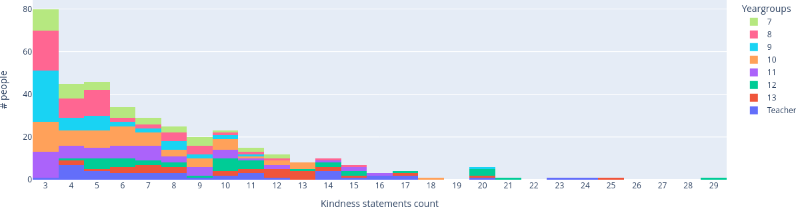

## What are kindness clouds?

Last year, the highschool student committee that focuses on wellbeing hatched a brilliant plan: they'll setup a anonymousness form so people can send kind statements to each over, and they'll collect up all the responses and send everyone a personal wordcloud of the results.

They failed to consider one factor: people loved this idea. They got hundreds upon hundreds of responses, so they ended up spending copious quantities of time manually generating creating wordclouds, and sending them out. 

This year, to help the wellbeing committee scale the concept up even bigger, I automated every step from the spreadsheet of responses to emailing out everyone their own personalised wordcloud.

#### An auto generated wordcloud

## Automation Steps
### 1. Link Kindness Statements to Student Identities
 - To ensure no students are missed, first we lookup all the kindness statements and fuzzy match them to the School's database of student and staff.
### 2. Generate Wordclouds for each student
 - Using a modified version of wordcloud.py for full-colour emoji support, generate a themed wordcloud image with everyone's shorter statements
### 3. Draw longer texts onto the bottom of each wordcloud
 - Some people sent out full paragraphs and poems to people, which don't fit on a wordcloud at all, so they are layed out and drawn on using ImageDraw.
### 4. Upload to Fileserver
 - Now that all the complete wordcloud images are generated, they are now uploaded to my file storage server, so they can be hotlinked in the email
### 5. Export MailMerge spreadsheet
 - With all of the hotlink links to the images, we cheat a bit and using MailMerge to send out the emails. It can't merge in file assets, but it can merge in HTML that hotlinks images with download buttons.
 - My tool exports a CSV, which is imported into a simple Google Sheet template with a MailMerge script on it, which can send emails from a personal Google Workspace account within the school.

## Participation
<HorizontalContainer>
    <LiveCard>
        3766 Kindness Statements Received
    </LiveCard>
    <LiveCard>
        374 Wordcloud's Generated
    </LiveCard>
</HorizontalContainer>

### Wellbeing Kindness Statement Participation
